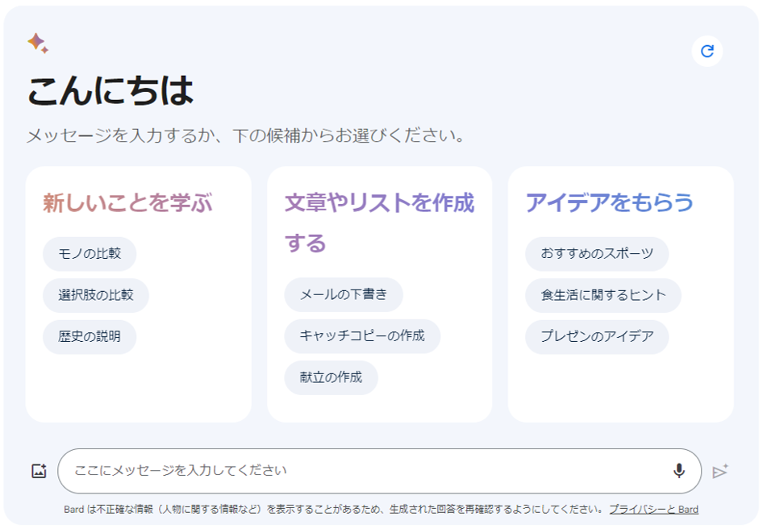
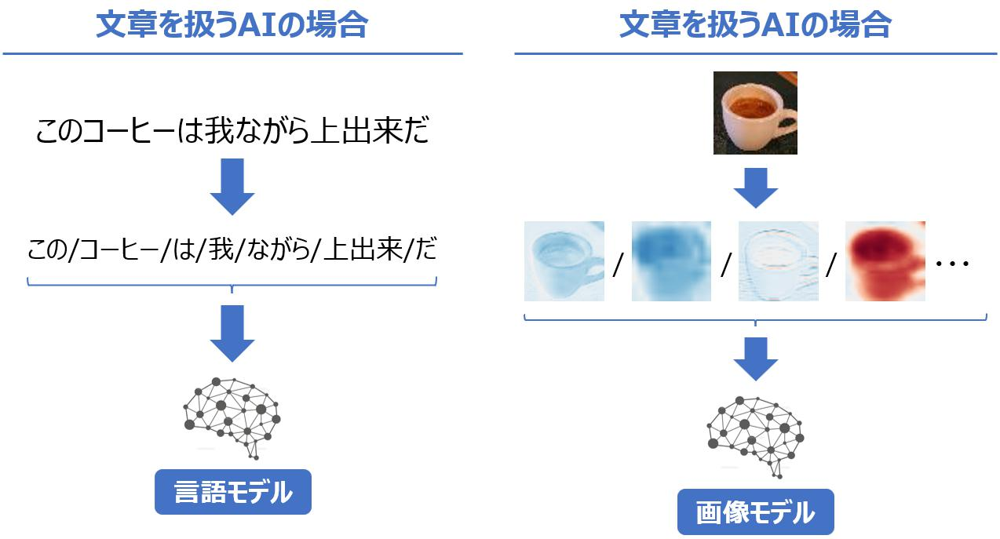
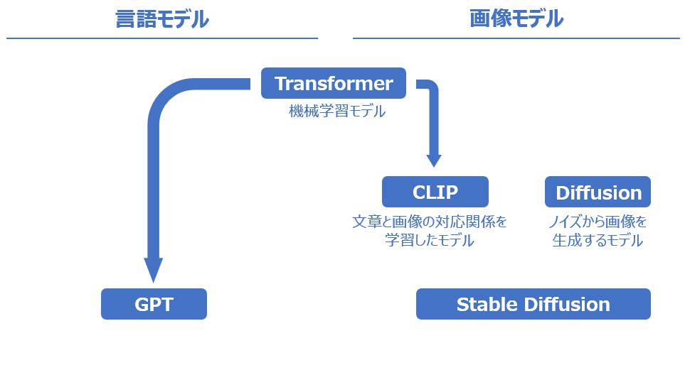

---
link:
  - rel: 'stylesheet'
    href: '_css/main.css'
lang: 'ja'
---

# 1章 文章解析と画像解析の重要性{#h1_1 .chapter}

XX何か書く？XX

## 生成AIなのに、 なぜ文章解析と画像解析なのか？{#h2_1 .section}
<!-- @hashtag:#pekepeke@hashtagend 
@hashtag:#言語モデル@hashtagend 
  -->
 

人間が入力した自然文のリクエストに対して自然文で回答したり、対応する画像を生成する生成AIが数多く登場しています。
2022年に公開されたChatGPTは、分野によっては人間の作文と遜色ない文章を生成することができ、2021年8月にはハリウッドスターのディープフェイク（deepfake）を用いて作成されたCM動画

出典：https://www.youtube.com/watch?v=XSUQwwOm3G4

が公開されました。
この動画には、ハリウッド俳優のBruce Willis氏
映画"Die Hard"（1988年）、"The Fifth Element"（1997年）、等に出演。上記のCM動画には、これらの出演映画を学習したdeepfakeが使用されており、当時のWillis氏の外見が再現されています。出典：https://www.bbc.com/news/technology-63106024

の肖像を学習して生み出したdeepfakeが使用されており、ロシアの通信企業であるMegafon社の広告に使用されました。同氏は失語症を患い2022年に俳優業の引退を公表していますが、CM公開当時は同氏が自身のdeepfakeを作成する権利を売却したとのニュースが流れ、同氏の体調不良の噂と相まって「本人が引退しても新作映画や広告などに出演し続けられるじゃないか！」と話題になりました。後日、売却の事実はないと同氏の代理人により否定されていますが、このCMのように、単発契約でdeepfakeを作成する可能性あるとのことです。

@div:figure
{height=105}
{height=105}
<!-- CNN
https://www.bbc.com/news/technology-63106024
INSTAGRAM
https://www.instagram.com/p/Cc0EhIhsqB8/
REUTERS
https://www.reuters.com/video/watch/idOVEVO57JB
 -->

左：実際のCM動画からの抜粋（演じているのはロシアの俳優）
 
右：ＣＭ動画中でWillis氏を演じる俳優（左）と、Willis氏のdeepfake画像（右）

@divend

このCM動画はWillis氏側の許諾を得て製作されましたが、このように本人の精巧なコピーを生成して自由に演技させる他、実際の俳優の演技をAIで修正したり、人間の俳優を使わずにモブ役（エキストラ）を生成して演技させることが技術的に可能なため、2023年にはAI使用の制限を求めてハリウッドで大規模なストライキが発生しました。また、昨今は生成AI技術を悪用して虚偽の情報を流布する事件も社会問題として顕在化しています。

映像に留まらず、数秒の音声データから人の声を忠実に再現するAIが開発されるなど、生成AIの種類は多岐に渡ります。生成AIは、文章や画像を単なる文字や色の羅列として捉えているわけではありません。
生成される情報が文章や画像であれ、生成AIは何かしらの方法で文章や画像といったデータを解析し、学習しています。昨今の生成AIは言語モデルを基本とし、言語と画像を組み合わせることで、文章から画像を生成したり、文章と音声データを組み合わせることで音声を生成したりします。このように、別々の性質の情報を同時に扱うAIをマルチモーダルAIと表現しますが、本書では昨今の生成AIの基本となる言語モデル、そして画像などの別のモーダルをどのように組み合わせているのかという事に注目します。

生成AIモデルがどのようにデータを処理し、生成を行うのかを理解することで、より効果的な活用が可能となるでしょう。仕組みを理解することで、生成AIを利用する際に生じる課題や制約を正確に把握することができ、人間と生成AIとの「最適な付き合い方」を知るヒントを得ていきましょう。

<h4>ディープフェイク（deepfake）</h4>

ある人物の顔や音声などを、著名人等の別人のものに置き換えたコンテンツの事で、既に聞き馴染みがある方も多いかもしれません。2017年にインターネット上の掲示板に"deepfakes"というユーザが機械学習アルゴリズムで作成したポルノを投稿し、以降広く使用されるようになりました。"Oxford English Dictionary"という英語辞書がありますが、deepfakeが単語として同辞書に掲載されたのは2023年3月。生成AIの進化によって単語が創出されたことを考えると感慨深いですね。

因みに虚偽情報を指す"fake news"という単語はTrump元大統領がメディアに対して発言したことを端に、2016年以降に広く使用されるようになったようです。

<!-- 因みに虚偽情報を指す"fake news"という単語はTrump元大統領がメディアに対して発言したことを端に、2016年以降に広く使用されるようになったようです。 -->
<!-- このように高品質の文章や画像や動画が生成できてしまうが故に、悪意を持って使えば偽りの情報（いわゆるfake news）を生成して流布する事が出来てしまいます。 -->
<!-- "Armageddon"（1998年）、 -->
<!-- fake newsが単語として登場したのは2016年 -->
<!--
これらのモデルは表面的な形式（例えば言語モデルであれば単語の出現頻度やパターン）を学習しているだけで、真に物事を理解している訳ではないという説が古くからある一方で、時空間を理解している可能性があるとの研究結果
2023年10月にMIT（マサチューセッツ工科大学）が公開した論文*"Language Models Represent Space and Time"*によれば、大量のデータを学習したことによって我々が生活する空間や時間といった概念を構造的な知識（"world model"）として有している可能性が述べられています。 （https://doi.org/10.48550/arXiv.2310.02207）
や、言語モデルと人間の脳の活動パターンが類似するという研究結果
2023年10月にコペンハーゲン大学らの研究チームが公開した論文*"Structural Similarities Between Language Models and Neural Response Measurements"*によれば、特定の単語やフレーズに応答する際の、AIモデルの活性化状態の可視化イメージと、人間の脳の活性化状態のfMRI（機能的磁気共鳴画像法：脳の血流から活動状況を調べる手法）イメージを比較したところ、モデルの規模が大きくなるに連れて類似するという結果が得られたそうです。著者らは、言語モデルは飽くまでも表面的な形式に基づいており、本質的な意味理解が不足しているという論説（いわゆる"Newman's objection"）を否定しています。
 （https://doi.org/10.48550/arXiv.2306.01930）
が公開されています。
他人の頭を覗くことが出来ないように、生成AIの中身（思考過程）を理解する事は非常に困難です。一方で、中身を十分に理解していないと使えないか、というとそうではないのです。実際にビジネス運用にも耐え得るサービスが登場していることからも分かる通り、これらの生成AIの得手を上手く活用する事で、従来の作業を効率化したり、新たな価値を生むことも可能なのです。
-->

### 生成AIの種類と、文章生成AIと画像生成AIの関係
一口に生成AIと言っても、質問文に対して自然文を生成する文章生成AIや、画像を生成する画像生成AI、動画や音声を自動で生成するAIも登場しています。主な生成AIの例としては、次のようなものが挙げられます。
- 文章生成AIの例GPT-4やBardでは画像を認識する機能が導入されているため、単なる文章生成AIという括りではないかもしれません。OpenAIは"a large multimodal model"であるとしています。(https://openai.com/research/gpt-4)

  - GPT（OpenAI社）	
    - 主なサービス：ChatGPT
  - PaLM2（Google社）
    - 主なサービス：Bard
  - Llama（Meta社）
    - 無償で商用利用も可能
- 画像生成AIの例
  - DALL-E（OpenAI社）
    - 主なサービス：ChatGPT Plus
  - Stable Diffusion（オープンソース）
  - Midjourney（Midjourney, Inc.）
- 動画生成AIの例
  - AnimateDiffAnimateDiffは、Stable Diffusionをベースとして利用しつつ、数百万本の動画を学習させた"Motion module"を適用することで、文章プロンプトから動画を生成します。
（オープンソース）
- 音声生成AIの例音声合成（Text to Speech）とも。従来から自動読み上げソフトといった文章を音声に変換する技術は存在しますが、今までは声の波形を操作して音声を合成する方式が一般的でした。VALL-Eは、言語モデルと、音色、声の高さ、イントネーションなどの要素を組み合わせて学習した"a neural codec language model"を用いており、テキストの意味を正確に理解して自然な音声を生成することができます。（https://arxiv.org/abs/2301.02111）

  - VALL-E（Microsoft社）

ChatGPTやBardなどのWebサービスでは、入力画面にメッセージ（プロンプト）を入力して送信ボタンをクリックすることで結果が出力されます。言い換えると、Web画面を通じて言語モデルを呼び出して活用しいるのです。

@div:figure
{height=150}

Google Bardの入力画面

@divend

#### 生成AIの基本はTransformer
昨今の生成AIにおいては、Transformerという要素技術が用いられています。Transformerは機械学習モデルの一種であり、Attentionと呼ばれる手法を適用して、同じデータ系内にある隔たったデータ要素間の微妙な相互影響や相互依存関係を見つけ出す能力に長けています。端的に言えば、モデル自体が、データ（文章や画像など）の特徴を自ら抽出して、自ら学ぶようなイメージです。Transformerの勃興以前は、人間が何らかの形で特徴をモデルに教える必要があると考えられていました。文章の場合はトークンと呼ばれる構成要素であり、画像の場合は畳み込みと呼ばれる要素です。

  - トークンとは、文章を構成する単位の事で、国語の授業で扱った文節に分けるイメージが近いかもしれません。本書の第3章で扱います。
  - 畳み込みとは、画像の輪郭や色味といった特徴を抽出することです。本書の第6章で扱います。

例えば、「このコーヒーは我ながら上出来だ」という文章を「この/コーヒー/は/我/ながら/上出来/だ」という構成要素に分割して学習に用います。この時点で、「コーヒー」「上出来」といった当該文章中の重要な特徴をモデルに解釈させることができます。このように大量の文章を学習させることによって言語モデルが作り上げられます。更に、この文章に対して「嬉しい」というラベルを付けて学習させることにより、この文章には「嬉しい」という感情が含まれていることを学習することができます。このように、文章に感情などの属性を付与して学習させることにより、言語モデルは、文章の意味だけでなく、感情や意図なども理解することができるようになります。
同様に、コーヒーカップの写真から、畳み込みという処理によって特徴を抽出します。抽出された特徴を人間が解釈する事は難しいですが、カップの輪郭や色味といった特徴を学習に用います。更に、この画像に対して「コーヒーカップ」というラベルを付けて学習させることにより、この特徴はコーヒーカップを表すということを学習する事が出来ます。

@div:figure
{height=200 }
@divend

このように学習した言語モデルと画像モデルは、それぞれコーヒーについての特徴を理解しています（昨今のモデルは非常に複雑であり、実際にどのように理解しているかについては専門家の間でも議論されています
2023年にコペンハーゲン大学の研究者らによって発表された論文によれば、人間の脳神経反応をfMRIを用いて分析したところ、特定の単語やフレーズの言語処理（リスニングやリーディン）を行った際の脳の活性化領域に幾何的な関係があり、言語モデルの規模が大きくなるにつれて、人間の脳の反応構造に類似するとのことです。言語モデルが更に強力になり、人間に近い表現を生成できるようになれば、人間の言語理解の研究や、言語障害の治療法開発など、様々な分野で大きな影響を与える可能性がありそうですね。（https://arxiv.org/abs/2301.02111）

）ので、コーヒーカップの写真と「このコーヒーは我ながら上出来だ」という文章とを合わせて学習することによって、文章を見ただけで対応する画像を特定したり、画像を見て対応する文章を特定することができます。

@div:figure
{height=200 }
@divend

文章や画像を生成するにしろ、どのようにデータを解析し、特徴を理解するかという点に工夫があります。図中のGPTは”Generative Pretrained Transformer”の略であり、Transfomerで大量の文章を事前学習する事によって、学習データ中にある種々の情報を把握し、高い文章生成能力を獲得したモデルです（昨今のChatGPTを始めとしたチャットアプリケーションは、このGPTを利用しています）。図中のCLIPという技術は、言語と画像を関連付けて処理する手法です。ある画像と、その画像に対する説明文の言語表現とを紐づけて学習することで、言語表現と画像表現とを行き来できるため、昨今の文章から画像を生成するAIにおいては不可欠となっています。
この章では、生成AIも機械学習モデルの一種であって、Transformerが基礎になっているというイメージを持っていただければと思います。

### AIは文章と画像を数字の羅列で捉えている
生成AIモデルの中身は複雑で、十分に理解できていない部分も多分にありますが、アルゴリズムの組み合わせによって機能する人工知能です。つまるところ、中身は数字で表現されていて、何らかの規則（ここが複雑なのですが）によって文章や画像を生成しています。結局は数字なのですが、言語や画像といった、一見すると数字とはかけ離れている表現を、どのように学習して、どのように生成しているのか、という部分に焦点を当てて解説します。
モデルの中身については論文の紹介程度に留める事とし、そもそも何故、言語や画像を生成AIが扱えるのか、すなわち、どのように「文章を解析」し、「画像を解析」し、人工知能が理解できる数字に変換しているか、という点に焦点を当てて紹介したいと思います。
生成AIモデルの中身については、現状も専門家であっても意見が分かれている上、今後も進化が見込まれますが、背景にある文章解析、画像解析の原理自体は、昨今の生成AIの基礎となっています。これらの解析技術を理解することは、生成AIの得手不得手を理解することにも繋がり、皆さんがどのようにして生成AIを活用していくヒントになるでしょう。

### 生成AIに対するよくある疑問
生成AIをビジネスで推進したいという相談をよく耳にします。一方で、生成AIに対する理解度は人によってバラつきがあり、漠然とした疑問を持っておられる方もいらっしゃいます。本書を手に取った読者の中には、既に生成AIに対して具体的な疑問を持っている方もいらっしゃるかと思いますが、それは次のような疑問ではないでしょうか？
本書を読み進める中で、これらの疑問に対する答えが浮かび上がってくるかと思います。関連するキーワードは@hashtag:#ハッシュタグ@hashtagend形式で記載しましたので、読み進める手がかりとしてください。

#### ① 大半は英語で学習されているから、日本語だと精度が良くないのでは？
@hashtag:#離散化@hashtagend 
@hashtag:#word2vec（skip-gram, CBOW）@hashtagend 

現在のところ、大規模言語モデルは言語に依存しない、というが通説です。言語モデルは言語を数字変換し、内部表現を獲得（離散化）しています。このように獲得した内部表現は、人間の言語に依存しない、独自の表現を持つことが分かってきています2023年10月の論文では、大規模言語モデルが単に文章を生成するための統計（確率）を計算しているだけでなく、物事がどのように位置づけられ、時間がどのように進行するかを「理解」している可能性が新たに示されています。大量の文章を学習していく中で、我々の住んでいる世界の構造化された知識をも獲得していることを示唆しています。（https://arxiv.org/pdf/2310.02207.pdf）
。よって、学習時や問いかけ時の言語には依存せずに、利用することが可能です。ただし、学習に用いた文献は英語圏のものが多いOpenAIが公開した論文では、GPT-3の学習に使用されたデータの93％が英語とのことです。学習データについては非公開とされる場合が多いのですが、特定の言語に特化したモデルではない限りは、他のモデルでも同様な構成比であることが推察されます。（https://arxiv.org/pdf/2005.14165.pdf）
ため、英語圏の慣習に従うような回答が多めになると言われています。

#### ② 古いデータで学習されており、最新情報にはついていけない
@hashtag:#RAG（Retrieval Augmented Generation）@hashtagend 
@hashtag:#Embedding@hashtagend 
@hashtag:#ベクトルDB@hashtagend

モデルの作成には大量の学習が必要になるため、リアルタイムでモデルを更新していくことは困難です。例えば、ChatGPTでは2021年9月までのデータが学習されています無償版ChatGPTには"gpt-3.5"系の言語モデルが使用されており、2021年09時点のデータで学習されています。2023年11月に発表された"gpt-4-turbo"系の言語モデルは2023年4月までのデータで学習されています。（https://platform.openai.com/docs/models/）
。一方で、有償版のChatGPT、MicrosoftのBeing、GoogleのBardでは、インターネット検索も可能なため、学習時には知りえなかった知識についても、言語モデルを更新することなく回答する事が可能になっています。モデルの更新をせずに最新情報を扱うという事は、例えると、全く土地勘がない地方新聞を読むイメージに近いかもしれません。その土地固有のお祭り情報や慣習については解像度が下がるかもしれませんが、日本語自体は読解できるので、記事の内容は理解することができます。このように、外部情報を与えてあげる事によって、より。

#### ③ 生成物にバラつきがあり（毎回、回答が異なる）信用できない
@hashtag:#ハルシネーション@hashtagend 
@hashtag:#プロンプトエンジニアリング@hashtagend 
@hashtag:#chain-of thought learning@hashtagend 
@hashtag:#zero/one/few shot learningg@hashtagend 
プロンプトやTemperatureを変えて同じ質問文を投げてみる
プロンプトの工夫や設定（Tempareture）によって解消に向かう（完全な解決ではないが…）
https://github.com/giuven95/chatgpt-failuresを紹介してもいいかも

### 各章のつながり
本書では生成AIの土台となるTransformer、文章解析と画像解析の技術について、非エンジニアでも直感的に理解しやすいように記述します。

生成AIモデル自体については詳細を扱いませんが、Transformerのイメージを掴む上で基本となる機械学習モデルについて第2章で扱います。ここでは、数字を予測する単純な線形モデル、ゼロ/イチを予測するロジスティク回帰モデル、ニューラルネットワークについて扱います。
これらの「数字を扱う」モデルについて理解を深めると、「自然言語や画像を扱う」にはどうすればいいのか、という疑問が生じる事かと思います。そこで、自然言語については第３章～第５章で、画像については第6章～第8章で、それぞれ解説します。

まず、自然言語をどのように数字に変換して扱うのかについて第３章で述べます。自然言語を数字に変換する術があれば、機械学習モデルで自然言語を扱うことができるようになりますので、実務で良く用いられている文章分類問題を例に、第４章で実際のコードを動かしながら理解を深めていきます。文章を分類するという作業は、要は文章から新たな情報を生むという作業です。どのように生成AIに発展するのか、という点について第５章で述べます。
画像についても、どのように画像を機械学習モデルで扱い、生成AIに発展するのかについて、第6章～第8章で紹介します。

