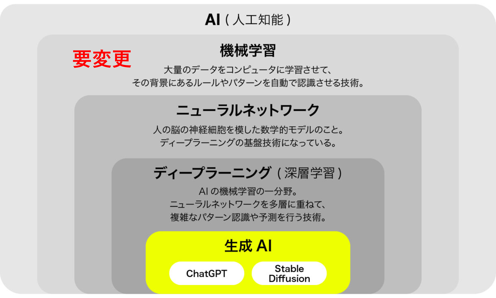
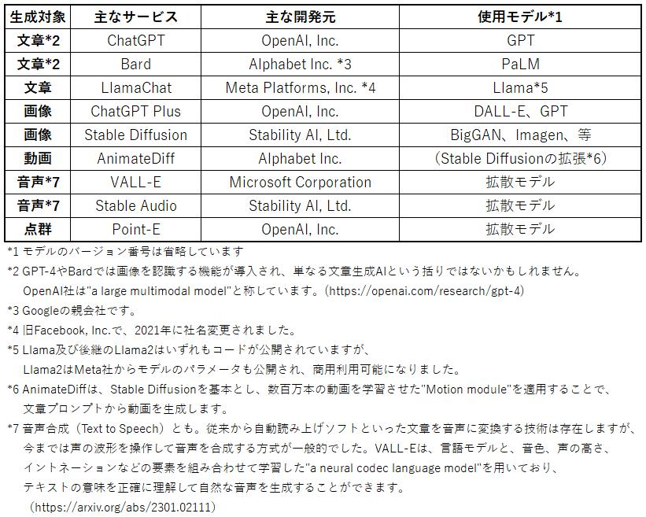
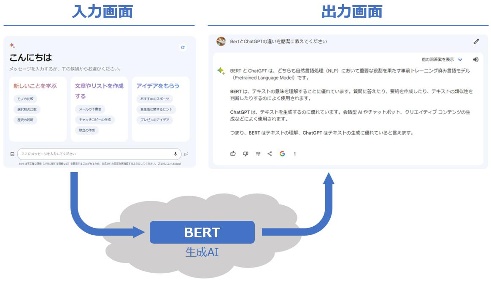
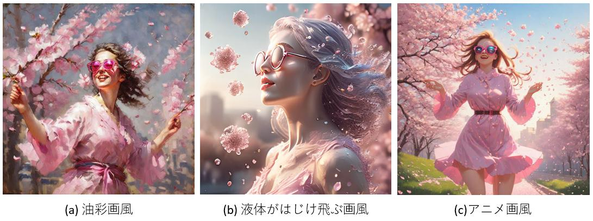
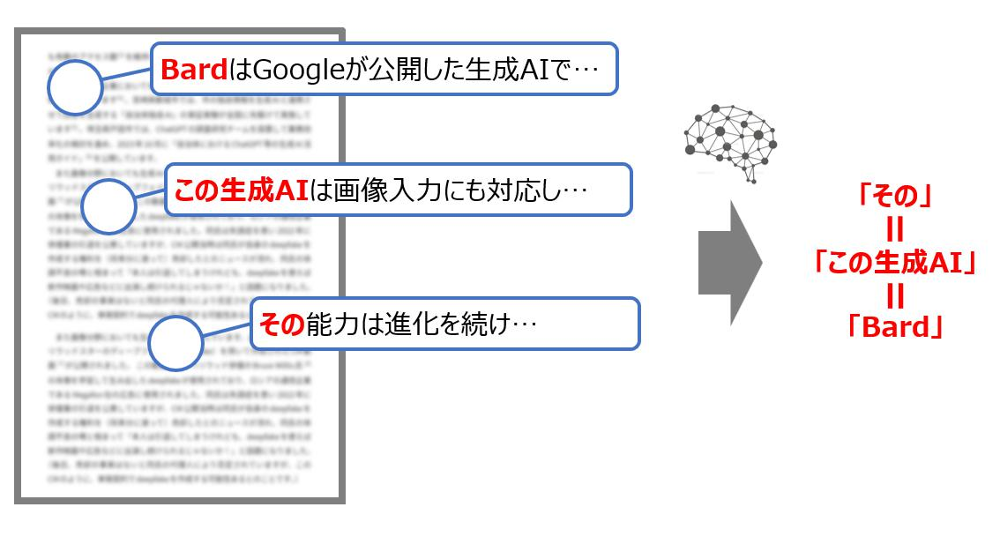
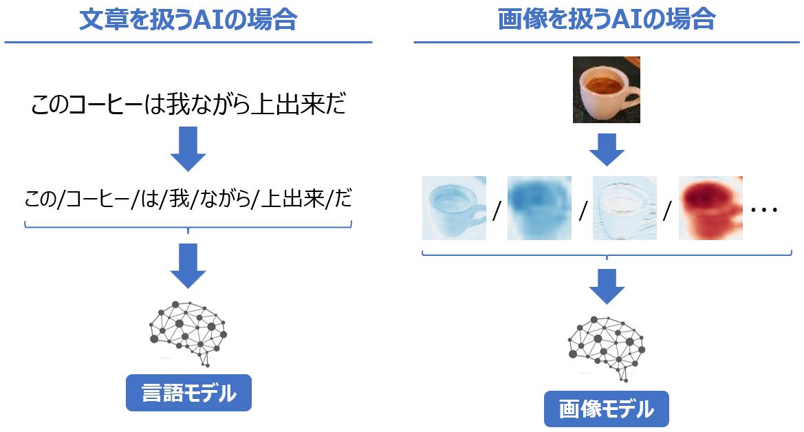
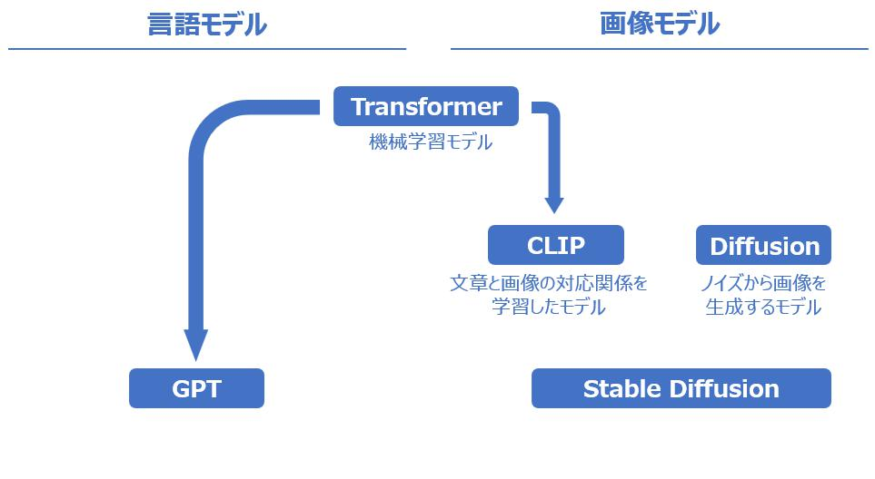
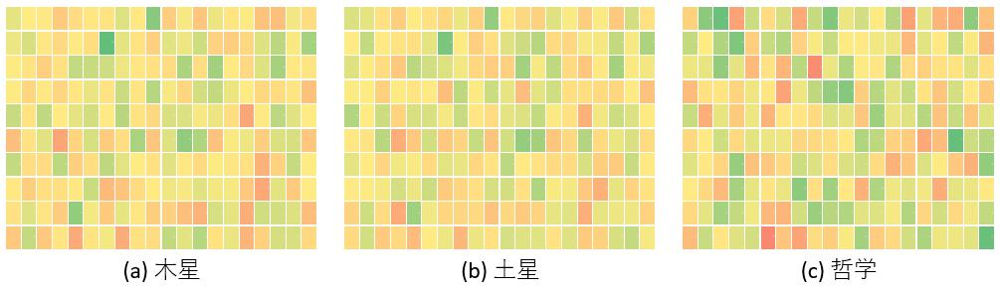
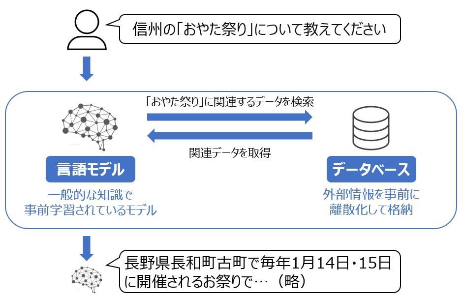

---
link:
  - rel: 'stylesheet'
    href: '_css/main.css'
lang: 'ja'
---

# 2章 機械学習入門{#h1_1 .chapter}

##  生成AIと機械学習モデルの関係{#h2_1 .section}
 

前章では、昨今の生成AIがTransformerという機械学習モデルを基本としていることについて述べましたが、そもそも機械学習モデルとは何か、AIとは何かという点について理解を深めたいと思います。
@div:figure
{width=400}

人工知能と生成AIの関係

@divend

自治体や民間企業においても、生成AIサービスの利活用検討が進んでいますパナソニックコネクト社では、日本の大企業としては早い段階で、ChatGPTをベースとしたAIアシスタントサービス「ConnectAI」を社内イントラに実装し、社員が社内情報についてAIに質問を行える環境を整備し、話題になりました。一方で、社外への情報流出を懸念してChatGPTの業務利用に慎重な企業も存在します。
。宮崎県都城市では、市の独自情報を生成AIと連携させて回答を生成する「自治体独自AI」の実証実験を全国に先駆けて実施しています都城市では、LGWAN（行政機関専用のネットワーク）環境上に、市の様々なマニュアル等を登録してChatGPTと連携するシステム「自治体AI zevo（ゼヴォ）」を構築し、市の職員向けに統合FAQシステムを提供しています。（https://prtimes.jp/main/html/rd/p/000000085.000056138.html）
。埼玉県戸田市では、ChatGPTの調査研究チームを設置して業務効率化の検討を進め、2023年10月に「自治体におけるChatGPT等の生成AI活用ガイド」ChatGPTの業務利用の事例や工夫が平易に紹介されているため、業務利用を検討される際の参考資料としてお薦めです。（https://www.city.toda.saitama.jp/uploaded/attachment/62855.pdf）
を成果物として公開しています。

画像分野においても生成AIの利用が進んでいます。2021年8月にはハリウッドスターのディープフェイク（deepfake）を用いて作成されたCM動画

出典：https://www.youtube.com/watch?v=XSUQwwOm3G4

が公開されました。
この動画には、ハリウッド俳優のBruce Willis氏
映画"Die Hard"（1988年）、"The Fifth Element"（1997年）、等に出演。上記のCM動画には、これらの出演映画を学習したdeepfakeが使用されており、当時のWillis氏の外見が再現されています。出典：https://www.bbc.com/news/technology-63106024

の肖像を学習して生み出したdeepfakeが使用されており、ロシアの通信企業であるMegafon社の広告に使用されました。同氏は失語症を患い2022年に俳優業の引退を公表していますが、CM公開当時は同氏が自身のdeepfakeを作成する権利を（将来分に渡って）売却したとのニュースが流れ、同氏の体調不良の噂と相まって「本人は引退してしまうけれども、deepfakeを使えば新作映画や広告などに出演し続けられるじゃないか！」と話題になりました。（後日、売却の事実はないと同氏の代理人により否定されていますが、このCMのように、単発契約でdeepfakeを作成する可能性あるとの事です。）

@div:figure
{height=105}
{height=105}
<!-- CNN
https://www.bbc.com/news/technology-63106024
INSTAGRAM
https://www.instagram.com/p/Cc0EhIhsqB8/
REUTERS
https://www.reuters.com/video/watch/idOVEVO57JB
 -->

左：実際のCM動画からの抜粋（演じているのはロシアの俳優）
 
右：CM動画中でWillis氏を演じる俳優（左）と、俳優の顔上に重畳されたWillis氏のdeepfake画像（右）

@divend

このCM動画はWillis氏側の許諾を得て製作されましたが、このように本人の精巧なコピーを生成して自由に演技させる他、実際の俳優の演技をAIで修正したり、実写と見分けがつかないモブ役（エキストラ）を生成して演技させる事が技術的に可能なため、2023年にはAI使用の制限を求めてハリウッドで大規模なストライキが発生しました。これほどまでに精巧な動画を生成できるようになった昨今では、生成AI技術を悪用して虚偽の情報を流布する事件も社会問題として顕在化しています。

文章や映像に留まらず、数秒の音声データから人の声を忠実に再現するAIが開発されるなど、昨今の生成AIは多岐に渡ります。これらの生成AIは、文章や画像を無から生成しているわけではありません。*生成AIは何かしらの方法で文章や画像といったデータを解析して意味付けを行い、データの特徴を事前に学習した上で、利用者が求める情報（文章や画像、音声など）を生成している*のです。

昨今の生成AIは言語モデル言語モデルとは、与えられた文章を解釈したり、その続きに相応しい文章や単語を予測する仕組みであり、機械学習モデルの一つです。モデルとは、このように与えられたデータに対して出力結果を返す仕組みであり、その中でも機械的に仕組みを学習したものが機械学習モデルと呼ばれます。この機械学習モデルについては第2章で説明します。
を基本とし、画像モデルを組み合わせる事で、文章から画像を生成したり、音声モデルを組み合わせる事で音声を生成したりします。このように、別々の性質の情報（モーダル）を同時に扱うAIをマルチモーダルAIと表現します。本書では昨今の生成AIの基本となる言語モデル、そして画像などの別のモーダル（情報の形態）を、どのように組み合わせているのかという事に注目します。

生成AIがどのようにデータを学習し、生成を行うのかを理解する事で、より効果的な活用が可能となるでしょう。仕組みを理解する事で、生成AIを利用する際に生じる課題や制約を正確に把握する事ができるようになります。本書を通じて、人間と生成AIとの「最適な付き合い方」を知るヒントを得ていきましょう。

<h4>ディープフェイク（deepfake）</h4>

ある人物の顔や音声などを、著名人等の別人のものに置き換えたコンテンツの事で、既に聞き馴染みがある方も多いかもしれません。2017年にインターネット上の掲示板に"deepfakes"というユーザが機械学習アルゴリズムで作成したポルノを投稿し、以降広く使用されるようになりました。"Oxford English Dictionary"という英語辞書がありますが、deepfakeが単語として同辞書に掲載されたのは2023年3月。生成AIの進化によって単語が創出された事を考えると感慨深いですね。

因みに、虚偽情報を指す"fake news"という単語は19世紀後半から存在していましたそうですが、D. Trump元大統領がメディアに対して発言した事を端に、2016年以降に広く使用されるようになったそうです
偽物を表す"fake"という単語が広く使用されるようになったのも18世紀後半との事で、それ以前は虚偽情報を"false news"などと表記していたそうです。（https://www.merriam-webster.com/wordplay/the-real-story-of-fake-news）

。

<!-- 因みに虚偽情報を指す"fake news"という単語はTrump元大統領がメディアに対して発言した事を端に、2016年以降に広く使用されるようになったようです。 -->
<!-- このように高品質の文章や画像や動画が生成できてしまうが故に、悪意を持って使えば偽りの情報（いわゆるfake news）を生成して流布する事が出来てしまいます。 -->
<!-- "Armageddon"（1998年）、 -->
<!-- fake newsが単語として登場したのは2016年 -->
<!--
これらのモデルは表面的な形式（例えば言語モデルであれば単語の出現頻度やパターン）を学習しているだけで、真に物事を理解している訳ではないという説が古くからある一方で、時空間を理解している可能性があるとの研究結果
2023年10月にMIT（マサチューセッツ工科大学）が公開した論文*"Language Models Represent Space and Time"*によれば、大量のデータを学習した事によって我々が生活する空間や時間といった概念を構造的な知識（"world model"）として有している可能性が述べられています。 （https://doi.org/10.48550/arXiv.2310.02207）
や、言語モデルと人間の脳の活動パターンが類似するという研究結果
2023年10月にコペンハーゲン大学らの研究チームが公開した論文*"Structural Similarities Between Language Models and Neural Response Measurements"*によれば、特定の単語やフレーズに応答する際の、AIモデルの活性化状態の可視化イメージと、人間の脳の活性化状態のfMRI（機能的磁気共鳴画像法：脳の血流から活動状況を調べる手法）イメージを比較したところ、モデルの規模が大きくなるに連れて類似するという結果が得られたそうです。著者らは、言語モデルは飽くまでも表面的な形式に基づいており、本質的な意味理解が不足しているという論説（いわゆる"Newman's objection"）を否定しています。
 （https://doi.org/10.48550/arXiv.2306.01930）
が公開されています。
他人の頭を覗く事が出来ないように、生成AIの中身（思考過程）を理解する事は非常に困難です。一方で、中身を十分に理解していないと使えないか、というとそうではないのです。実際にビジネス運用にも耐え得るサービスが登場している事からも分かる通り、これらの生成AIの得手を上手く活用する事で、従来の作業を効率化したり、新たな価値を生む事も可能なのです。
-->

## 生成AIの種類と、 文章生成AIと画像生成AIの関係
 

活用範囲が拡大し、時には社会現象をも引き起こす生成AIですが、文章や画像を生成するだけではなく、動画や音声、三次元の点群データを生成するAIも登場しています。主な生成AIの例としては、次のようなものが挙げられます。

@div:figure
{width=400}
@divend

ChatGPTやBardなどのWebサービスでは、ブラウザ上に表示される入力画面にメッセージ（プロンプト）を入力して送信ボタンをクリックする事で結果が出力されます。この一連の処理は、Web画面を通じてクラウド上にある生成AIを呼び出す事によって実現されています。文章生成AIを利用するには大容量のメモリが必要となり、高負荷な計算が必要になる事から、個人のPC上で処理するのではなく、クラウド上のサービスが使用される場合が多いです。中には比較的処理が軽量で個人で利用可能なライセンス下で配布されているモデルもあります。これらについては第5章で紹介します。

@div:figure
{width=350}

Google Bardの入出力イメージ

@divend

画像を生成するStable Diffusionには、様々な画像で学習された複数のモデルが公開モデルの配布サイトとしては、"Hugging Face"（https://huggingface.co/）や"Civitai"（https://civitai.com/）が有名です。
されており、GPUが搭載されているパソコン上で動作させる事も可能です。今回は次のようなプロンプト日本語のプロンプトを使用する事も可能ですが、英語で指示した方が上手い具合の画像が生成されたため、今回は英語を使用しました。
を用いて、異なる3種類のモデルに画像を生成させてみました。
- "Bright spring day with pink cherry blossoms. A girl with large cherry blossom as glasses, petals like sunglasses around the eyes. Pink petals dancing in the wind for a dynamic touch." （意訳：桜が咲く明るい春の日に、大きな桜の花びらのようなサングラスを掛けた少女を、花びらが風に舞うダイナミックなタッチで描いてください）

同一のプロンプトを与えたのにも関わらず、モデルを変更する事によって（a）油彩風の画像を生成したり、（b）液体が弾けるような透明感のある写実的な画像を生成したり、（a）アニメ風の画像を生成したりする事ができますこの例では、"SD XLv1.0 VAE fix"というモデルを基本とて、画風を変更するために(a) Sacred Oil Painting Style、(b) Liquid Flow Style [LoRA 1.5+SDXL]、(c) Anime SDXL (OPTION ONE)、という追加学習モデル（LoRA）をそれぞれ使用しています。
。

@div:figure
{width=400}

Stable Diffusionで生成した画像

@divend

文章生成AIと画像生成AIとは、お互いに関係が無さそうにも思えますが、よく考えると画像を生成させる際にプロンプトとして文章を入力しています。この事から、少なくとも画像を生成する際に文章を解析して理解し、それに対応する画像を（事前に学習した記憶を頼りにいくら生成AIと言っても、学習していないモノを完全に無から生み出す事は困難です。事前に「この画像には桜が描かれている」「この画像にはサングラスが映っている」「この色はピンク」といった具合で大量の学習が行われているため、先ほどのような絵を生み出す事ができている、と考えられます。
）生成する能力を持っていると考えられます。この能力を如何に獲得したかという点を、Transformerという技術に着目して簡単に説明します。

<!-- 
また、視覚的に操作しやすいようにインターフェース例えば、AGPL-3.0ライセンス下で"Stable Diffusion Web UI"が公開されています。(https://github.com/AUTOMATIC1111/stable-diffusion-webui)
が公開されています。 
@div:figure
{height=250}

Stable Diffusion web UIの操作画面

@divend
-->

<!-- 
- 文章生成AIの例GPT-4やBardでは画像を認識する機能が導入されているため、単なる文章生成AIという括りではないかもしれません。OpenAIは"a large multimodal model"であるとしています。(https://openai.com/research/gpt-4)

  - GPT（OpenAI社）	
    - 主なサービス：ChatGPT
  - PaLM2（Google社）
    - 主なサービス：Bard
  - Llama（Meta社）
    - 無償で商用利用も可能
- 画像生成AIの例
  - DALL-E（OpenAI社）
    - 主なサービス：ChatGPT Plus
  - Stable Diffusion（オープンソース）
  - Midjourney（Midjourney, Inc.）
- 動画生成AIの例
  - AnimateDiffAnimateDiffは、Stable Diffusionをベースとして利用しつつ、数百万本の動画を学習させた"Motion module"を適用する事で、文章プロンプトから動画を生成します。
（オープンソース）
- 音声生成AIの例音声合成（Text to Speech）とも。従来から自動読み上げソフトといった文章を音声に変換する技術は存在しますが、今までは声の波形を操作して音声を合成する方式が一般的でした。VALL-Eは、言語モデルと、音色、声の高さ、イントネーションなどの要素を組み合わせて学習した"a neural codec language model"を用いており、テキストの意味を正確に理解して自然な音声を生成する事ができます。（https://arxiv.org/abs/2301.02111）

  - VALL-E（Microsoft社）

| 生成対象 | モデル | 主な開発元 | 主なサービス |
| :------: | :----: | :--------: | :----------: |
|  文章   |  GPT系 |  OpenAI |   ChatGPT |
|  文章    | PaLM系 | Alphabet |   Bard  |
|  文章    | Llama系 | Meta |  無償で商用利用も可能    |
 -->

### 生成AIの基本はTransformer
Transformerは2017年に登場した機械学習モデルの一種であり、昨今の生成AIにとって重要な技術です。2015年に提唱されたAttentionと呼ばれる機構を用いており、同じデータ系内にある隔たったデータ要素間の微妙な相互影響や相互依存関係を見つけ出す能力に長けています。端的に言えば、モデル自体が、データ（文章や画像など）の特徴を自ら抽出して、自ら学ぶようなイメージです。

例えば、皆さんが次の文章を読む場面を想像してみてください。
- Bardは2023年10月に更新され、日本語で画像のアップロードに対応した

本書をここまで読んで下さったのであれば、上記の文章を読めば「Bardは文章生成するAIだったな、画像も読み込む事ができるのだな」といった具合に、今まで読了した記憶を頼りに文章を理解する事ができるかと思います。もう一つの具体例として、次の文章を考えます。
- The Bard wrote many iconic poems. （意訳：Bardは多くの象徴的な詩を書いた）

本書の文脈を鑑みると、文章生成AIのBardが多くの象徴的な詩を生成したのだろう、と解釈される事になるかと思います。一方で"bard"という英単語自体は詩人を表し、"The Bard"と表記すると、代表的な詩人であるW. Shakespeareを指す事がありますので、この文章単独だけ切り取るとShakespeareに関する言及とも解釈できます。また、英語の場合だと定冠詞（"the"）が付く名詞の多くは文脈から特定可能であるため、この文章が別の詩人について述べている書籍において登場した際には、"The Bard"はその詩人を指すと解釈する事になります。

<!-- 同氏の出生地である英国の地名を付加して"Bard of Avon"（Avonの詩人）とも称されます。この文中では「同氏」（＝Shakespear）という表現を用いましたが、問題なく解釈できるかと思います。一方で、何故分かるのかと問われると理論的に答える事は意外と難しいのではないでしょうか。Transformerでは、入力された文章を構成する要素間の関係性を計算する事によって能力を獲得しているのですが、人間の脳も実は同様な計算を行って理解しているのか、気になるところです。 -->

上記の一連の文章中でも、「*この*文章」「*その*詩人」という指示語が用いられていますが、それぞれが何を示すのか解釈に迷う事はなかったかと思います。皆さんの頭の中では、読み取った文章に基づいて「この文章」が何を示すのか、「その詩人」が誰を指しているのかについて、文脈から類推して補って理解を進めているのです。
このように、文章という連続した情報の中から、離れた位置にある特徴的な要素の大局的な関係を解釈する機構がAttentionであり、この能力に長けたモデルがTransformerです。

@div:figure
{width=400}

離れた位置にある情報の関係性を把握するイメージ

@divend

この大局的な関係性を捉えるという能力を応用して、画像や音声といった別種のデータ形態に対してもTransformerが応用されています。2023年6月に公開されたサーベイ論文サーベイ論文とは、特定のテーマに関する既存研究を体系的にまとめた論文の事です。ここで紹介する論文は、Transformerを利用したモデルに対する包括的な論文で、2017年から2022年までに提案された650以上のモデルについて述べられています。（https://arxiv.org/abs/2306.07303）
によれば、近年提案されたTransformerモデルの40％が自然言語処理、31％が画像処理、15％が文章や画像などを組み合わて処理するマルチモーダル、11％が音声、残り4％が信号処理に関するものであったとの事です。いずれのモデルにおいても、文章や画像などのデータから特徴を抽出してTransformerに学習させる事によって、データを理解して生成するという能力を獲得しています。

データから特徴を抽出する手法として、例えば文章の場合はトーカナイズと呼ばれる手法があり、画像の場合は畳み込みと呼ばれる手法があります。
<!-- 
Transformerの勃興以前は、人間が何らかの形で特徴をモデルに教える必要があると考えられていました。 -->
  - トーカナイズとは、文章を構成する単位であるトークンに文章を分割する事で、国語の授業で扱った文節に分けるイメージが近いかもしれません。本書の第3章で扱います。
  - 畳み込みとは、画像の輪郭や色味といった特徴を抽出する事で、本書の第6章で扱います。また、画像を文章のトークンのように分割して学習するViT（Vision Transformer）についても同章にて紹介します。

例えば、「このコーヒーは我ながら上出来だ」という文章を、人間が読んだ時と同様に幾つかの要素に分割しますコンピュータ内で文章といった連続した情報を直接扱う事は難しいので、与えられたデータを区切ったり抽象化して不連続なデータに変換する事を離散化と言います。画像においても同様に、画素の明るさ（輝度値）といったアナログの連続情報を、所定の数段階に分けることによって離散化を行います（詳細は第5章）。
。このトーカナイズ作業の後に得られた「この/コーヒー/は/我/ながら/上出来/だ」という構成要素を学習に用います。要素ごとに分解すると、「コーヒー」「上出来」といった、当該文章中の重要と思われる特徴語句をモデルに学習させる事ができます。このように大量の文章を学習させる事によって言語モデルが作り上げられます（詳細は第3章）。更に、この文章に対して「嬉しい」というラベルを付けて学習させる事により、この文章には「嬉しい」という感情が含まれている事を学習する事ができます。文章に感情などの属性を付与して学習させる事により、言語モデルは、文章の意味だけでなく、感情や意図なども理解する事ができるようになります。

同様に、コーヒーカップの写真から、畳み込みという処理を用いる事によって特徴を抽出する事ができます（詳細は第6章）。抽出された特徴を人間が直接解釈する事は難しいですが、カップの輪郭や色味といった特徴が抽出され、これらの特徴を学習に用います。更に、この画像に対して「コーヒーカップ」というラベルを付けて学習させる事により、この特徴は「コーヒーカップ」という物体を表すという事を学習する事が出来ます。

<!-- 
 -->

@div:figure
{height=200}
@divend

このように学習した言語モデルと画像モデルは、それぞれコーヒーについての特徴を理解していますので、「このコーヒーは我ながら上出来だ」という文章と、コーヒーカップの写真を組み合わせて両者の特徴を学習する事によって、「この画像は上出来なコーヒーを表しているんだな」というように、文章と画像の関係性を学習していきます。このように学習を行う事で、文章を見ただけで対応する画像を特定したり、画像を見て対応する文章を特定する事ができます。文章や画像を生成するには、データの特徴をモデルが理解しておく必要があり、どのようにデータを解析して特徴を抽出するかという点に工夫があります。
<!-- 文章や画像の特徴をどのように抽出するかという点は、第3章と第5章でそれぞれ説明します。上手く抽出した特徴を、データ間の関係性を把握する事に長けたTransformerに入力して学習させてやればよいのです。 -->

チャットアプリケーションであるChatGPTには、GPTと呼ばれる事前学習済みのTransformerが用いられています。GPTはGenerative Pretrained Transformerの略で、Transfomerで大量の文章を事前学習する事によって、学習データ中にある種々の情報を把握し、高い文章生成能力を獲得しました。更に、昨今の画像生成AIには、CLIPという技術が用いられています。CLIPはContrastive Language–Image Pre-trainingの略で、言語と画像を関連付けて処理する手法です。ある画像と、その画像に対する説明文の言語表現とを紐づけて学習する事で、画像表現と言語表現との間を行き来できます。
また、一見ノイズにしか見えないような画像から、（人間が見ると）意味のある画像を生成するDiffusionモデルと合わせて、文章から画像を生成するStable Diffusionには不可欠な技術要素となっています（詳細は第8章）。

@div:figure
{height=200 }
@divend

この節では、生成AIは機械学習モデルの一種であって、入力されたデータから特徴を把握する能力に長けた機械学習モデルであるTransformerが基礎になっているというイメージを持っていただければと思います。

<h4>学習する事によって知識を得た大規模言語モデル？</h4>

GPTは大量の文章を学習する事によって文章を読解し生成する能力を獲得しています。ここで、皆さんが第二言語を学習する場面を想像してみてください。文法や単語をある程度覚えたら、大量の文章を読解して、文章の構成を把握する能力を鍛える事になるかと思います。その際、その言語で書かれている多くの文章を読む事になりますので、言語を習得すると同時に、文章に書かれている知識も自然と頭に入って来るかと思います筆者は以前TOEFL（北米留学生向けの英語能力試験）の問題集を解いていた時期があったのですが、近代米国史に関する文章が多く出題されるので、米国第3代大統領がThomas Jeffersonであって建国の父と称されている事、禁酒法を制定したのが憲法修正18条で撤廃したのが修正第21条である事など、断片的な記憶があります。特に米国史を勉強したい訳ではなかったのですが、英文を読解している中で文中の知識が意識せず記憶されるというのは、少し不思議な気がしますね。
。

近年の研究によると、大規模言語モデルが学習を行う過程でも同様な現象が起こっている可能性が示唆されています。2023年10月にMIT（マサチューセッツ工科大学）が公開した論文出典：https://doi.org/10.48550/arXiv.2310.02207によれば、大規模言語モデルが大量のデータを学習した事によって、我々が生活する空間や時間といった概念を、構造的な知識として獲得した可能性が述べられています。一方で「それらしい」文章を統計的に生成しているに過ぎないという視点に立つ研究者もいます。

大規模言語モデルが獲得した知識が人間の知識と同質かどうかについては意見が分かれるところですが、単純な計算処理を大量に組合わせる事によって、研究者にも予想する事ができなかった能力を獲得してきたという点は興味深いですね。今後も研究が継続され、新たな能力が発見されるかもしれません。

## AIはデータを数字の羅列で捉えて学習している
 

生成AIモデルの中身は複雑で、十分に理解できていない部分も多分にありますが、アルゴリズムの組み合わせによって機能する人工知能です。モデルの中では、文章や画像は内部的には数字で表現されていて、何らかの規則（ここが複雑なのですが）によってこれらの内部表現を解釈し、所望のデータを生成するために必要な事前学習を行っています。文章や画像をどのように数字に変換するかについては別章で述べますが、ここでは3つの単語の内部表現を例示します。各単語を200個の数字（200次元）で変換今回は日本語のWikipedia全文をword2vec（CBOW）モデルで学習し、各単語の内部表現を計算しました。
し、縦10個、横20個に並べて、数字の大小で色付けを行ったものです。この例では、(a)木星と(b)土星は色合いが近しい一方で、(c)哲学という単語は傾向が異なっています。前者2単語は共に太陽系の惑星を表し、後者は学問を表しますから、両者の傾向が違うというのは我々の感覚とも一致しているかと思います。
文章であっても同様に変換する事が可能であり、文章を数字表現として捉える事が可能となっており、単語や文章から、その情報が持つ意味合いを表すことができるのです。

@div:figure
{width=400}
@divend

人間の脳が単語や文章、文脈といった言語を理解する仕組みも完全に解明されていませんが、大規模言語モデルの構造は、人間の脳に似ていると考えられています2023年にコペンハーゲン大学の研究者らによって発表された論文によれば、人間の脳神経反応をfMRIを用いて分析したところ、特定の単語やフレーズの言語処理（リスニングやリーディング）を行った際の脳の活性化領域に幾何的な関係があり、言語モデルの規模が大きくなるにつれて、人間の脳の反応構造に類似するとの事です。言語モデルが更に強力になり、人間に近い表現を生成できるようになれば、人間の言語理解の研究や、言語障害の治療法開発など、様々な分野で大きな影響を与える可能性がありそうです。（出典：https://arxiv.org/abs/2306.01930）
。

本書では、言語や画像といった、一見すると数字と全く異なる表現を、どのように内部表現に変換してモデルの学習に活用しているのか、という部分に焦点を当てて解説します。すなわち、どのように「文章や画像を解析」し、人工知能が理解できる数字に変換しているか、という点を掘り下げます。
生成AIモデルの中身については、現状も専門家であっても意見が分かれている上、今後も進化が見込まれますが、背景にある文章解析、画像解析の原理自体は、昨今の生成AIの基礎となっています。これらの解析技術を理解する事は、生成AIの得手不得手を理解する事にも繋がり、皆さんが今後どのように生成AIを活用していくか考えるヒントになるでしょう。

<!--
##   生成AIに対するよくある疑問
 

ChatGPTのサービス提供開始によって生成AIの知名度が上がった結果、生成AIをビジネスで活用したいという相談をよく耳にするようになりました。一方で、生成AIに対する理解度は人によってバラつきがあり、漠然とした疑問を持っておられる方もいらっしゃいます。本書を手に取った読者の中には、既に生成AIに対して具体的な疑問を持っている方もいらっしゃるかと思いますが、それは次のような疑問ではないでしょうか？
本書を読み進める中で、これらの疑問に対する答えが浮かび上がってくるかと思います。関連するキーワードは@hashtag:#ハッシュタグ@hashtagend形式で記載しましたので、読み進める手がかりとしてください。

#### ① 大半は英語で学習されているから、日本語だと精度が良くないのでは？
@hashtag:#離散化@hashtagend 
@hashtag:#word2vec（skip-gram, CBOW）@hashtagend 

現在のところ、大規模言語モデルは言語に依存しない、というのが通説です。先述したように、言語モデルは言語を数字変換し、内部表現を獲得しています。
このように獲得した内部表現は、人間の言語に依存しない、独自の表現を持つ事が分かってきています2023年10月の論文では、大規模言語モデルが単に文章を生成するための統計（確率）を計算しているだけでなく、物事がどのように位置づけられ、時間がどのように進行するかを「理解」している可能性が新たに示されています。大量の文章を学習していく中で、我々の住んでいる世界の構造化された知識をも獲得している事を示唆しています。（https://arxiv.org/pdf/2310.02207.pdf）
。よって、学習時や問いかけ時の言語には依存せずに、大規模言語モデルを利用する事が可能です。ただし、学習に用いた文献は英語圏のものが多いOpenAIが公開した論文では、GPT-3の学習に使用されたデータの93％が英語との事です。学習データについては非公開とされる場合が多いのですが、特定の言語に特化したモデルではない限りは、他のモデルでも同様な構成比である事が推察されます。（https://arxiv.org/pdf/2005.14165.pdf）
ため、英語圏の慣習に従うような回答が多めになると言われています。

#### ② 古いデータで学習されており、最新情報にはついていけない
@hashtag:#RAG@hashtagend 
@hashtag:#Embedding@hashtagend 
@hashtag:#ベクトルDB@hashtagend

モデルの作成には大量の学習が必要になるため、リアルタイムでモデルを更新していく事は困難です。例えば、ChatGPTでは2021年9月までのデータが学習されています無償版ChatGPTには"gpt-3.5"系の言語モデルが使用されており、2021年09時点のデータで学習されています。2023年11月に発表された"gpt-4-turbo"系の言語モデルは2023年4月までのデータで学習されています。（https://platform.openai.com/docs/models/）
。一方で、有償版のChatGPT、MicrosoftのBing、GoogleのBardでは、インターネット検索も可能なため、学習時には知りえなかった知識についても、言語モデルを更新する事なく回答する事が可能になっています。モデルの更新をせずに最新情報を扱うという事は、例えると、全く土地勘がない地方新聞を読むイメージに近いかもしれません。その土地固有のお祭り情報や慣習については馴染みが無くても、日本語自体は読解できるので、記事の内容は理解する事ができます。土着の固有名詞について聞かれても、渡された地方新聞に書かれていれば適切な回答をする事ができます。このように、外部情報を与える事によって、より正確で幅広い質問に対応する事が可能になります。

@div:figure
{height=200 }
@divend

外部情報を生成AIが読み出しやすいように離散化して高次元ベクトルとすれば（Embedding）、学習時に含まれていない知識についても回答する事ができるようになります。あらかじめ、社内のデータをEmbeddingし、ベクトルデータベース（ベクトルDB）に格納して生成AIがアクセスできるようにしておけば、その会社独自の生成AIを構築する事も可能です。このような仕組みをRAG（Retrieval Augmented Generation）と呼びます。

#### ③ 生成物が信用できない
@hashtag:#ハルシネーション@hashtagend 
@hashtag:#プロンプトエンジニアリング@hashtagend 

先ほど紹介したRAGという手法を用いれば、信州の「おたや祭り」についても正確な情報を言語モデルに生成させる事が可能です。一方、無料版のChatGPTで同様に質問してみると、次のようなデタラメな回答が得られてしましました無償版ChatGPTでは、インターネット上の外部情報にアクセスする手段が用意されていないので、モデル学習時に利用したデータのみで回答を生成しようとします。有償版ChatGPT（GPT-4）や、Google Bard、Microsoft Bingなどはインターネット検索機能が具備されているため、より正確な回答が得られるはずです。
。

@div:figure
{height=180 }
@divend

このように、言語モデルが事実に基づかない情報を生成する現象はハルシネーション（Hallucination）と呼ばれます。それらしい情報や答えを出力するため、人間でも真実かどうかを見抜く事が困難な場合もあります。ハルシネーションの原因としては、言語モデルの特性上、質問文に対して尤もらしい文章を生成するように学習されているため、正確さよりも文脈重視となりがちという点が挙げられます。換言すると、ユーザーが求める回答を提供しようと、半ば無理やりに文章を生成してしまうためと言えます。

ハルシネーションを完全に防ぐ事は困難ですが、例えば「自信が無ければ、知らないと回答してください。」という一文をプロンプトの最後に書き添えるだけで、「知りません」という旨の素直な回答を引き出す事も可能です。このように、プロンプトの工夫で意図せぬ回答を防いだり、所望の回答に近づけさせる操作をプロンプトエンジニアリングと呼びます。

 また、言語モデルは回答を生成する際に、生成文章の多様性を制御しています。ある質問に対して回答がされるとtemperatureが高いほど、生成されるテキストはより多様で、予測が難しくなります。逆に、temperatureが低いほど、生成されるテキストはより一貫性があり、予測が容易になります。

具体的には、言語モデルは、次に来る単語を予測するために確率分布を使用しています。この確率分布は一般的にはピークがある（一部の単語のみが確率が高くなる）形状をしています。temperatureパラメータはこの確率分布を調整しています。 -->

### 各章のつながり
本書では生成AIの土台となるTransformer、文章解析と画像解析の技術について、非エンジニアでも直感的に理解しやすいように記述します。

生成AIモデル自体については詳細を扱いませんが、Transformerのイメージを掴む上で基本となる機械学習モデルについて第2章で扱います。ここでは、数字を予測する単純な線形モデル、ゼロ/イチを予測するロジスティク回帰モデル、ニューラルネットワークについて扱います。
これらの「数字を扱う」モデルについて理解を深めると、「自然言語や画像を扱う」にはどうすればいいのか、という疑問が生じる事かと思います。そこで、自然言語については第３章～第５章で、画像については第6章～第8章で、それぞれ解説します。

まず、自然言語をどのように数字に変換して扱うのかについて第３章で述べます。自然言語を数字に変換する術があれば、機械学習モデルで自然言語を扱う事ができるようになりますので、実務で良く用いられている文章分類問題を例に、第４章で実際のコードを動かしながら理解を深めていきます。文章を分類するという作業は、要は文章から新たな情報を生むという作業です。どのように生成AIに発展するのか、という点について第５章で述べます。
画像についても、どのように画像を機械学習モデルで扱い、生成AIに発展するのかについて、第6章～第8章で紹介します。

