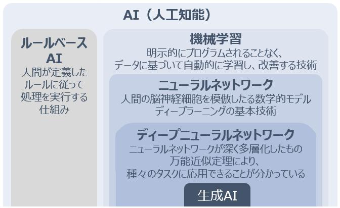
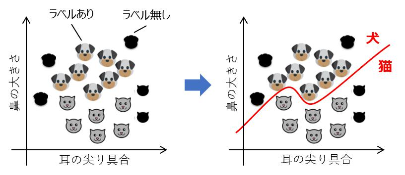

---
link:
  - rel: 'stylesheet'
    href: '_css/main.css'
lang: 'ja'
---

# 2章 機械学習入門{#h1_1 .chapter}

##  生成AIと機械学習モデルの関係{#h2_1 .section}
 

前章では、生成AIの背景にはTransformerという機械学習モデルがあると述べましたが、そもそもAIとは何か、機械学習モデルとは何か、という点に始まり、生成AIの基礎となるディープラーニングまで理解を深めていきます。図X-Xに、大まかな関係を図示しましたので、この図を参照しつつ本文を読み進めて下さい。

@div:figure
{height=250}

図X-X 人工知能と生成AIの関係

@divend

### AI（Artificial Intelligence）とは

昨今はAIという言葉が汎用的に使用されるようになり、非常に広範囲なサービスや仕組みにAIという言葉が冠されている場面も見受けられます。2023年には、米国連邦取引委員会がAIを使ってオンラインストアの売り上げを増やすという根拠のない謳い文句で消費者に損害を与えたとして、このサービスを提供する会社を提訴消費者に与えた損失額は2,200万ドルとのこと。訴状によると被告企業は「AIやchatgptのようなツールを使って、月1万ドル以上稼ぐ！」等と案内しており、日本でもありそうな広告だな、という印象でした。（事件番号3:23-cv-01444、"Federal Trade Commission v. Automators LLC"）するなど、行き過ぎたAI表示このように、AIを使用していないのに使用しているように見せることを"AI washing"と表現するメディアも現れました。（https://www.techopedia.com/ai-washing-everything-you-need-to-know/2/34841）環境配慮をしているように装う"greenwashing"や、白人以外の役柄に白人俳優を配役する"whitewashing"という表現は既にOEDに登録されていますが、近い将来に"AI washing"も新語として登録されるかもしれません。
に対する規制色も強まっています。なお、同委員会は日本における公正取引委員会に相当し、同訴訟はAI関連の虚偽表示に関する同委員会初の個別案件となりました。

文献を見渡すとAIは様々に定義され、時には広い意味を持つことがあります例えば、我が国の総務省は次のように説明しています。「AIに関する確立した定義はない（中略）あえていえば、『AI』とは、人間の思考プロセスと同じような形で動作するプログラム、あるいは人間が知的と感じる情報処理・技術（略）」（令和元年版情報通信白書）。AIという言葉の定義が立場により不明確である以上、AI関する概念を理解する事は（先ほどのような詐欺まがいの案件に引っかからないためにも、）機械学習やディープラーニングを理解する上でも重要となりますので、少し範囲を広げて説明します。

そもそもAIは、1965年のダートマス会議で用いられるようになった言葉です。この会議ではAIの研究の方向性や目標が議論され、AIの研究が本格的に始まるきっかけとなりました当時ダートマス大学で数学助教授だったJohn McCarthy氏が主催した世界初のAIに関する国際会議で、第1次AIブームのきっかけとなります。自然言語処理や、ニューラルネットワークに関する研究を含む7つの議題を提起し、今日も研究が継続されています。（https://doi.org/10.1609/aimag.v27i4.1904）
。
ここで、AIという単語の意味合いを考慮すると、人工的（Artificial）な知能（Intelligence）ですから、*人間が備えているような知能を人工的に再現するもの*、と説明できそうです。
昨今の生成AIの発展を鑑みると、何をもって知能と定義するかについては意見が分かれるところですが、凡そ次のように記述する事が出来そうです。

- 幅広い環境において目標を達成する（学習能力、適応能力を含む）能力人工知能研究者であるM. Hutter氏が、2007年に公開した論文"A Collection of Definitions of Intelligence"（意訳：「知能」の定義集）では、辞書、哲学者、AI研究者らによる合計70余りの「知能」に対する定義がまとめられています。本論文では、最終的に“Intelligence measures an agent’s ability to achieve goals in a wide range of environments...Features such as the ability to learn and adapt, or to understand...”という表現を採用しており、本書ではこの意訳を紹介しました。少し古い論文ではありますが、多くの論文（2020年以降に公開された論文を含む）に引用されています。（https://arxiv.org/abs/0706.3639v1）

この定義を読むと、昨今の生成AIは一部の領域では既に人間の回答能力を上回っていることから、既に知能を獲得したように思えますが、「幅広い環境において」という表現がポイントです。現在のAIは種々のモーダリティを扱う事が可能で、幅広い環境（分野）の中における特定のタスクにおいて優秀な能力を発揮しますが、幅広い環境を跨いで人間と同様な認識能力や知的作業を実行できるわけではありません。このように環境を問わず汎用的な能力を獲得したAIはAGIAGIはArtificial General Intelligenceの略で、strong AI、Full AIとも称されます。と呼ばれています。

#### AGI（Artificial General Intelligence）
直訳すると*汎用人工知能*となり、strong AI（強いAI）、Full AI、等とも表記されます。このレベルに達すると人間と同等な知能作業が可能になるため、文脈によってはHuman Level AIとも表現されます。
このようなAGIは実現手法を探っている現状でり、現状は実現されていないと考えられています。この人間と同等な能力を獲得したAGIに対して、生成AIに代表されるような特定の能力（例えばChatGPTならば人間と対話する能力）に特化したAIを、ANIと呼びます。

#### AGI（Artificial Narrow Intelligence）
直訳すると*特化型人工知能*となり、weak AI（弱いAI）、Narrow AI、専門AI、等とも表記されます。現在ビジネスの場面でも用いられている、音声認識、画像認識、文章生成など、特定のタスクをこなすAIを指します。*世間一般的にAIといえばANIを指す*と考えてよいでしょう。

#### ASI（Artificial Super Intelligence）
直訳すると*人工超知能*となり、AGIから更に発展したAI、すなわち人間の能力を凌駕する能力を獲得したAIを指します。イメージとしては、近未来を描いたSF映画等に出てくるAIだと思ってよいでしょう。現状は存在しませんが、OpenAI社は2023年7月に、来るべきASIに備えて専用のチームOpenAI社が公開したBlogによれば、ASIは「人類が発明した中で最もインパクトがあり世界的に重要な多くの問題を解決する助けとなるだろうが、この能力は非常に危険で人類を無力化、あるいは絶滅させる可能性さえある。」と記述しています。（https://openai.com/blog/introducing-superalignment）を発足し、SAIが人類の期待とは別方向に進化しないように制御する（アラインメント問題に対応する）ために、今後4年間で20％の計算リソースを投入して取り組む旨を発表しています。

@div:figure
{height=200}

図X-X 一般的なAI（ANI）ーAGIーASIの位置づけ

@divend

ここまで述べただけでもAIという言葉が、実際にはAIではないものを指したり、まだ存在しないものを指したり、様々な意味合いを含んでいることがイメージできたかと思います。
ここで先述した知能の定義にあった学習、適応とは何かという点を考えたいと思います。

#### 学習、適応とは？
機械*学習*とは言いますが、AIにおける学習とは何なのか、具体例と共に理解を深めていきたいと思います。来院してくる患者が何の感染症に罹患しているかを診断する場面を考えてみましょう。感染症を特定するには、様々な診断や検査が必要です。そこで、事前に専門医の知見を集めて臨床基準を作成することにしました。患者に発熱はあるか？細菌を含む痰を咳き出しているか？患者には重大な感染を示唆する皮膚や血液の所見があるか？胸部X線は正常ですか？痛みや炎症があるか？などです。更に、発熱があった場合はXXが疑われる、咳や痰に細菌が含まれる場合にはYYを確認する、といった規則（ルール）を500程度に棚卸してフローチャートのような形にまとめました。実際に診断を行う際には、このフローチャートに従って質問に答えていけば、診断結果を得ることができるでしょう。このシステムは"MYCIN"と呼ばれ、実際に1970年代にスタンフォード大学で開発されたものです本書におけるMYCINの解説は、次の2文献に基づいています。"Rule-based Expert Systems : The MYCIN Experiments of the Stanford Heuristic Programming Project" (Edward H. Shortliffe,et al., 1984)、"Computer-Based Medical Consultations, MYCIN" (E.H. Shortliffe, 1976)。このシステムは人間の医師ら専門家（エキスパート）の知識を体系化して演繹的にルール化したもので、（ルールベース）エキスパートシステムこのMYCINは学術界では大きく取り上げられ、1977年のIJCAI（人工知能国際会議）では、このように知識体系をコンピューター内部で表現して利用する研究分野を知識工学（Knowledge Engineering）と命名し、AIの一分野を形成することになりました。と呼ばれます。実際のMYCINに登録されているルールは次のようなものです。

@div:figure
{height=150}

図X-X MYCINのルール例

@divend

このシステムは全てのルールを人間が定義したもので、学習によってルールを獲得した訳ではありません。知識を体系化する専門家（Knowledge Engineerと呼ばれていました）が専門家にインタビューしてルールを定義する必要がありました。先の定義を鑑みるとエキスパートシステムをAIには分類する事は難しそうです図X-Xに記したようにMYCINのルールはIF~THEN構文で記述され、計算表ソフトのExcel等で使用したことがあるかもしれません。NYCINの推論機構は複雑ですが、このような人間が決めたルールベースのシステムをAIと見做してしまうと、極端な話Excelで記述したIF文もAIになってしまい、線引きが困難になってしまいます。が、歴史的経緯を鑑みるとAIの文脈で語られ、AIに分類する文献も多いため、本書では広義のAI（ルールベースAI）として紹介しますこのようなルールベースのエキスパートシステムをAIではないと明示的に主張する文献も複数あります（例：https://doi.org/10.1016/j.bushor.2018.08.004）。
<!-- 更に、仮に新たな細菌感染症が発見されてこのシステムを更新するとなった場合、新しい診断基準を医師らで決定し、500ある既存の規則との組み合わせを考えて実装するというパズルのような作業が必要になるでしょう。この意味で適応能力があるとも言えなさそうです。 -->

では、過去の診断結果を使ってルールの中身、つまり感染症を*推論する構造を自動的に作成する*ことができたらどうでしょう。例えば、過去の診断データを分析し「XX感染症に罹患した人の体温は35.6℃以上だった」という示唆が得て「35.6℃以上であったらXX感染症と診断する」ルールを設けるといった具合に、データから帰納的にルールを計算してルールを組合わせる処理を機械学習と呼びます。このように人間がルールを教え込むことなく自律的に計算する所作を指して学習と表現されます。

学習データを与えさえすればルールを自動的に獲得するため、ルールや組み合わせを教えることが手間な場合や、人間でさえも明示的なルールが分からない場合であっても、データを与えれば自動でルールを見つけ出す事ができるため適応力に長けており、機械学習は有効な手段として昨今のAIの基本技術となっています。

@div:figure
{height=250}

図X-X ルールベースと機械学習

@divend

#### 参考：MYCINとの"対話"例

MYCINは、人間の知識を体系化したデータベースシステムが意思決定を行うために使用するルール、事実、ドメイン固有の知識を格納し、"Knowledge Base"とも称され、このような仕組みを持つシステムを"Knowledge Base"とも表現します。大局的には、ルールベースシステムの一部です。を持っており、そのデータベースに入出力を行うインターフェースを通じて人間と"対話"を重ねて疾患候補を特定します。（次の図では、50回以上の対話を繰り返して「細菌血症」という疾患名が出力されています。（初代ウォークマンが発表された時期('79)に、このシステムが動いていたというのは驚きですね）

@div:figure
{height=350}

図X-X MYCINとの"対話"例
<!-- Rule-based Expert Systems : The MYCIN Experiments of the Stanford Heuristic Programming Project / edited by Bruce G. Buchanan, Edward H. Shortliffe (Addison-Wesley, 1984) -->

@divend

この対話部分だけ切り取ると、人間のスペルミスにも対応するMYCINには類義語辞書が登録されており、多少の表記ゆれや簡単な入力ミスやスペルミスは自動的に修正する事が出来たそうです。など昨今のChatGPTと遜色が無いような処理を行っているかのように見えます。実のところ、内部では（スペルミスをも想定した）人間が作成した膨大なルールに基づいて所定の回答を提示しており、学習を重ねて対話能力を獲得したChatGPTとは異なっているのです。一方で、上記の結果だけをみると内部は分かりませんので、このようなシステムをAIと呼ぶかどうかについては、場面や立場により意見が分かれるところでしょう。

#### まとめ
一般的にAIと言われた場合は先述したANIを指し、学習能力を実現する手法として機械学習が主として用いられている、という事を押さえておきましょう。（実務的にはAI＝機械学習、というざっくりな見方もできそうです。将来的な展望を語る局面ではAGIなども含むと考えられるため、場面に応じた解釈が必要になりそうです）

次節では、昨今のAIにおいて欠かすことができない機械学習について理解を深めていきます。

<!-- 

<h4>MYCINとの"対話"例（載せる？）</h4>

MYCINは、人間の知識を体系化したデータベース（Knowledge Baseと呼ばれている）を持っており、そのデータベースに入出力を行うインターフェースを通じて人間と"対話"を重ねて疾患候補を特定します。（次の図では、50回以上の対話を繰り返して「細菌血症」という疾患名が出力されています。（初代ウォークマンが発表された時期('79)に、このシステムが動いていたというのは驚きですね）

{height=350}

この対話部分だけ切り取ると人間のスペルミスにも対応するなど昨今のChatGPTと遜色が無いような処理を行っているかのように見えます。内部では（スペルミスをも想定した）人間が作成した膨大なルールに基づいて動いており、学習を重ねて対話能力を獲得したChatGPTとは異なっているのです。一方で、上記の結果だけをみると内部は分かりませんので、このようなシステムをAIと呼ぶかどうかについては、立場により意見が分かれるところでしょう。

 
-->

<h4>結局AIとは何でしょう</h4>

本文中ではあえて明示的な定義を記述しませんでしたが、本文中で引用した知能の定義も斟酌すると『「幅広い環境において目標を達成する（学習能力、適応能力を含む）能力」をコンピューター上で再現するもの』、となります。この「幅広い環境」という表現の曖昧さにより、AGIとの境界が不明瞭となっている側面があります。また、先述した"MYCIN"や、1997年に当時のチェス世界王者を倒した"Deep Blue"米国IBM社が開発したチェス専用のスーパーコンピュータは両者ともに各領域で人間を上回る成果を出していますが、学習により能力を獲得していない点が本定義とは異なります。

アカデミックな世界から少し離れて、OECD勧告"Recommendation of the Council on Artificial Intelligence (May 21, 2019)"より意訳。および米国法"H.R.6216 - National Artificial Intelligence Initiative Act of 2020", SEC. 3 (3)より意訳。当時のOECD勧告よりも詳細な定義が盛り込まれています。による定義を見てみましょう。

- 人間が定義した特定の目的に対して、現実または仮想環境に影響を与える予測、推奨、決定を行うことができる機械ベースのシステム。さまざまなレベルの自律性で動作するように設計されている。

「知能」というからには学習能力が入っているべきだ、という視点に立てばエキスパートシステムはAIから除外されるでしょうし、OECDや米国のように広く定義すれば含まれる、といった具合でしょう。立法者の立場からすれば、学習の有無を問わず、示唆を生み出す機械がAIとしておけば、丸っとAIを定義できるので簡便なのかもしれません。

技術の発展に伴って新たな見方の出現が予想されます実のところ、最近の技術進展に伴ってOECD定義も3年も経たず2023年11月に更新されているのです！常に変化し得るという点にもご留意頂ければと思います（別述）。。AIに関連する話題に触れる際には「相手が指しているAIは何だろう？」という観点も意識してみてください。本節を読んでAIに対する幅広さを感じ、興味を持っていただければ幸いです。

<!-- 

- 「機械学習」は、明示的にプログラムされることなく、データまたは経験に基づいて自動的に学習し、改善する能力をシステムに提供することを特徴とする人工知能の応用

 -->

##  機械学習とは{#h2_2 .section}
 

人間の学習に相当する仕組みをコンピューターで再現する機械学習ですが、具体的には次の通り明文化できます。

- 明示的にプログラムされることなく、データまたは経験に基づいて自動的に学習し、改善する能力をシステムに提供することを特徴とする人工知能の応用米国法"H.R.6216 - National Artificial Intelligence Initiative Act of 2020", SEC. 3 (9)より意訳。

機械学習モデルを学習従来的な（非AI）ソフトウェア開発では、コードを記述しプログラムを作成する作業に相当します。するフェーズと、学習した機械学習モデルを利用するフェーズの2つに分けて、詳しく見てみましょう。
ここでは、「患者の属性や症状から感染症種別を判別する」タスク目的（Object）とも称されます。この例の場合は明示的な目的がありますが、昨今の生成AIに用いられている「自己教師あり学習」などには明示的な目的が与えられない事もあります（後述）。を考えます。

@div:figure
{height=200}

図X-X 機械学習の2つのフェーズ

@divend

### 学習フェーズ（training phase, build phase）
ここでは、大量のデータを機械学習アルゴリズムに供給し、機械学習モデルがタスクを精度良く実行できるようにパラメーターを最適化させます。最適化されたモデルを推論モデル（学習済みモデル）と呼びますが、この*推論モデルを最適化する処理が機械学習*です。

#### 学習データ（training data）
モデルを最適化する上で必要なデータであり、図中では過去の大量の診断結果を指します。数字、文章、画像、など様々なモダリティのデータが考えられます。

#### 特徴量と目的変数
特徴量は、モデルに入力する患者の属性や症状を指します。目的変数はターゲットとも呼ばれ、出力される感染症種別を指します。第1章で触れたように、機械学習モデルは数字しか理解できないので、「男性」「激しい咳」といった学習データに記述されている表現を数字表現に変換したものが用いられます。アルゴリズムはこれらを元にして、パラメーターを計算します。

#### 機械学習モデル
特徴量と目的変数を関連付ける仕組みで、ここでは経路のようなものだと考えてください。学習を開始する前には雛形しかなく、学習を通じて、与えられた特徴量に相当する感染症種別へ辿り着く最適な経路へと変化します。学習が完了したモデルの事を推論モデル（学習済みモデル）と表現します。

#### パラメーター
モデルを定義づける指標です。図中「35.6℃」「激しい咳」といったモデルの分岐条件を決定付けます。

#### アルゴリズム（機械学習アルゴリズム）
モデルがより高精度になるように、パラメーターを変更（更新）する仕組みです。モデルを雛形に例えるなら、アルゴリズムは、雛形を与えられた学習データに向けて改善させる手順書に相当しますこの手順書に従って雛形からモデルを作る造形師がコンピューターといったところでしょう。モデルが複雑になるとモデルのパラメーター数も増大しますので、大規模な計算資源が必要になります。。
このアルゴリズムとモデルは時として同一に語られることがありますので、図X-Xでアルゴリズムの働きについて詳しく見ていきましょう。

@div:figure
{height=200}

図X-X 学習フェーズの中身

@divend

アルゴリズムが機能する前、すなわち学習する前のモデルで出力される推論結果は正解（真の結果）とは程遠く、ズレが生じています。このズレを損失（Loss）と呼び、損失を計算する式（関数）を損失関数（Loss function）と呼びます。
この損失を小さくするために、アルゴリズムはどのようにパラメーターを変更すればよいかを計算計算手法としては、勾配降下法が広く用いられており、次節以降で扱います。し、機械学習モデルに反映します。学習フェーズでは、この一連の処理を繰り返して、損失が小さくなるようにモデルを更新し続けるこれ以上損失が小さくならなくなる時点まで計算を行いますが、過学習を防ぐために適当な時点で打ち切るような工夫もなされます。作業を行います。

### 推論フェーズ（inference phase, use phase）
ここでは、学習フェーズで構築した推論モデルにデータを入力して出力を得ます。一般的に機械学習（すなわちAI）を利用する場面では、利用者側はこのフェーズしか使っておらず、AIの運用フェーズとも言えます。

#### 入力データと出力データ
予測したい患者の属性や症状を指します。診断者が観測した患者の症状をモデルに入力します。
<!-- 
この際、モデル学習時に用いた特徴量と同じ表現でモデルに入力する必要があるため、通常は何らかの規則が必要です。
-->
出力側も同様に、モデルから出力された表現では人間が解釈できないので、学習時に用いた変換法と同様な手段を用いて変換結果を出力し、診断者に回答されます。

@div:figure
{height=150}

図X-X 推論フェーズの中身

@divend

### 機械学習の種類
機械学習は、学習方法によって次の通りに大別されます特に「教師あり学習」「教師なし学習」「強化学習」の3つに大別して紹介されることがあります。。（先ほどの感染症種別を識別する例では教師あり学習を意識していますが、コンセプトは学習方法によらず同様です）

@div:figure
{height=250}

図X-X 機械学習の種類と代表的なモデル

@divend

#### 教師あり学習（Supervised learning）
学習データに正解データが含まれている場合の学習手法です。例えば、画像に写っている物体を認識するタスクを学習するには、「この画像にが犬が映っている」といった、各画像に対する正解（ラベル）が割り振られているデータを学習データとし、正解を予測する方法を学習します。連続数字を予測する回帰問題や、データを特定のカテゴリに分類する分類問題に対して適用されます。本書では、線形回帰とロジスティック回帰を取り上げて具体的に説明します。

#### 半教師あり学習（Semi-Supervised learning）
昨今のAIを学習するには大量のデータが必要で、全てのラベルを用意する事は困難です。そこで、一部のデータのみにラベルを付与して学習する手法教師あり学習と教師なし学習の中間に位置する学習手法です。少量のラベル付きデータを用いてモデルを生成し、このモデルを使ってラベルなしデータに対して推論を行って、高い確信度を持つを新たなラベル付きデータとして学習に使用する"self-training"、どのラベル無しデータに優先的にラベル付与すべきかを能動的に決定する"active learning"など、種々の学習方法が提案されています。（https://doi.org/10.1007/s10994-019-05855-6）で、主に分類問題で用いられます。例えば、図X-Xのように「鼻の大きさ」「耳の尖り具合」といった定量的な測定値（特徴量）と、「犬」「猫」のラベルから、犬と猫とを識別する曲線を描くイメージです。

@div:figure
{height=150}

図X-X （半）教師あり学習のイメージ

@divend

#### 教師なし学習（Unsupervised）
ラベルが無いデータを学習し、データの構造やパターンを見つけ出す手法手法です。人間では気付きにくい（もしくはデータが多量で見切れない）データ内の隠れたパターンや構造を発見し、新しい知見を得るために用いられます。類似のデータをグループ化するクラスタリング（図X-X）といった手法が有名であり、顧客セグメンテーション等に用いられます。

@div:figure
{height=150}

図X-X 教師なし学習「クラスタリング」のイメージ

@divend

#### 自己教師あり学習（SSL; Self-Supervised learning）自己教師あり学習も、半自己教師あり学習も、頭文字は同じSSLですが、一般的にSSLと表記された場合には自己教師あり学習を指します。predictive learning（予測学習）、pretext learning（疑似学習）とも表記されます。教師あり学習に分類する文献（https://doi.org/10.1093/bib/bbab016, 2021）や、教師なし学習に分類する文献（https://doi.org/10.1007/s11831-023-09884-2, 2022）もあります。本書では独立した学習手法として取り上げました。
ラベルを含まない学習データから、ラベルを自動生成して疑似的なタスク（pretext task）を学習します。例えば大規模言語モデルの学習に用いられる手法で、この場合は与えられた文章の一部を穴埋めし、穴埋めされた箇所の単語や文章を予測する事によって、文章の構造や表現手法を獲得します。人間が穴埋めタスクを個別に定義している訳ではなく、文章を模倣学習しているのです従来は人間がAIに目的を与える必要があると理解されていましたが、このような学習法が新たに提案されたことによりAIの定義も変化しました（後述）。。この自己教師学習で学習されたモデルに対し、人間が期待する回答を出力する下流タスクをファインチューニング既に学習済みのモデルを特定のタスクやデータセットに合わせて微調整するプロセス。特に、大規模なデータセットで事前学習されたモデルを、比較的小規模なデータセットでの特定のタスクに適用する際に用いられます。させることによりChatGPT等の超高性能なチャットボットが作られています。このように、SSLは主に深層学習モデルの事前学習に用いられています。

#### 強化学習（RL; Reinforcement learning）
試行錯誤を通じて最適な行動（定義された報酬を最大化するような行動）を自律的に学習する方法です。ゲームプレイ人間がゲームのハイスコアを目指して攻略法を研究する様子に似ています。Google DeepMindによって開発された囲碁AI"AlphaGo"は強化学習を活用して2015年に人間のプロ囲碁棋士を破りました。囲碁は「膨大な探索空間と碁盤の位置を評価する事が難しく、AIにとって古典的なゲームの中で最も困難なゲーム」とされていたため、注目を集めました（http://dx.doi.org/10.1038/nature16961）。、自動運転車、ロボット制御などに応用されています。例えばゲームの場合は勝敗やスコアといった報酬を定量化して与え、自動運転の場合は「車線の内側を走行したら加点」「人や物体に衝突したら減点」といった具合で報酬を計算して与えます。

 
ChatGPTは、図X-XのようにChatGPTの前身であるInstruct-GPTの論文（https://arxiv.org/pdf/2203.02155.pdf）を参考にしました。論文という形では公開されていませんが、ChatGPTの学習法についてはOpenAIがブログ記事（https://openai.com/blog/chatgpt）を公開しており、同等な仕組みとなっています。教師あり学習と強化学習を組み合わせて作られており、おおよそ図X-Xを用いて次のように説明できます。

- 大量の文章に自己教師あり学習を行い文章構造に対する知識を獲得させます。このように作ったモデルを大規模言語モデルと呼びます
- この大規模言語モデルに対して、人間がプロンプトに対する好ましい回答例（Demonstration）を作成し、これを正解として教師あり学習（SFT; Supervised fine-tuning）を行います。
- このチューニング済モデルを使ってプロンプトに対する回答案を幾つか作成し、人間が最も好ましい選択肢を選び、この比較結果（Comparison）を学習して報酬モデルを作成します。この報酬モデルは人間の比較結果を再現できるようになります。
- チューニング済モデルに対して新しいプロンプトを入力して回答を生成させ、この回答を報酬モデルで評価し、より好ましい回答を生成するように強化学習を行います。

恐らく、人間のフィードバックを元に、教師あり学習と強化学習を行うコンセプトは理解し易い部分ではかったのではないでしょうか。このように人間のフィードバックを学習プロセスに組み込む手法をRLHF（Reinforcement Learning from Human Feedback）と呼びます。

本章では扱いませんでいたが、ChatGPTの起点となる大規模言語モデルがどのようにして作成され、なぜ知識を獲得したのかという点については第3章以降で説明します。

@div:figure
{height=300}

図X-X ChatGPTの学習法

@divend

本章ではAIと機械学習について理解を深めて頂くことが目的ですので、これから代表的な次の3つのモデルを通じて、機械学習の基本を押さえていきましょう。
- 線形回帰 ～”数字”を予測する～
- ロジスティック回帰 ～”ラベル（Yes/No）”を予測する～
- ニューラルネットワーク ～より複雑な問題を予測する～

<h4>AIに対する別の見方</h4>

本文中で紹介した自己教師あり学習は生成AIの基礎となる大規模言語モデルの学習に適用され、昨今の生成AIにおいて重要な技術となっています。ここで、前節で紹介した、AIの定義に関する2020年のOECD勧告を振り返ってみましょう。同定義の中に「人間が定義した特定の目的に対して」という文言があります。本文で紹介した自己教師あり学習は疑似的なタスク（pretext task）を学習します。「疑似的な」と訳しましたが、ニュアンス的には「でっち上げ」"pretext"という単語は、前を意味する接頭辞"pre-"と織物を表す"texture"から成ります。生地の前面を表すため、取り繕っている様や隠匿を意味する、どちらかというと悪い文脈で用いられる言葉です。となります。すなわち、人間では明確なタスクを与えているわけではなく自律的に文章を学習しているため、何をどのように学んでいるかについては未解明な部分も多いのです第1章MEMO「学習する事によって知識を得た大規模言語モデル？」を参照。。
少なくとも、この定義のままでは大規模言語モデル、ひいては生成AIを包含する事が困難であるため、2023年にOECDは勧告を次の通り更改しました。

- 明示的または暗黙的な目的のために、受け取った入力から、予測、コンテンツ、推奨、または物理的または仮想的な環境に影響を与えることができる決定などの出力を生成する方法を推論する機械ベースのシステム。システムによって、自律性や導入後の適応性のレベルは異なる。

また上記の定義は広く書かれており自律性の度合い（すなわち学習と適応能力のレベル）は問うていません。図X-X「機械学習の2つのフェーズ」と同様な事柄を、OECDはNewsletterで次の通り表現しています。

{height=300}

## 線形回帰 ～”数字”を予測する～

## ロジスティック回帰 ～”ラベル（Yes/No）”を予測する～

## ニューラルネットワーク ～より複雑な問題を予測する～

<!-- 
実際に米国では「AI」を誇張する企業
Aiming for truth, fairness, and equity in your company’s use of AI
https://www.ftc.gov/business-guidance/blog/2021/04/aiming-truth-fairness-equity-your-companys-use-ai
Keep your AI claims in check
https://www.ftc.gov/business-guidance/blog/2023/02/keep-your-ai-claims-check
 -->
