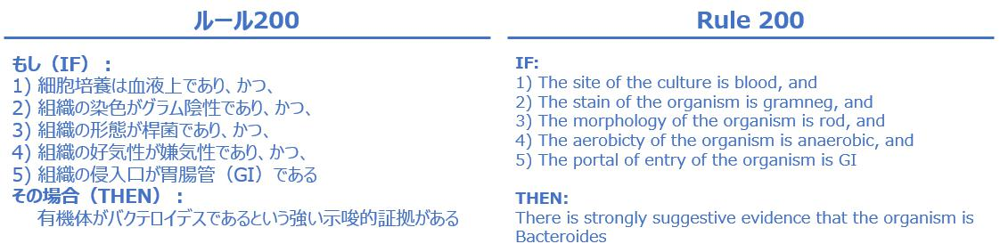
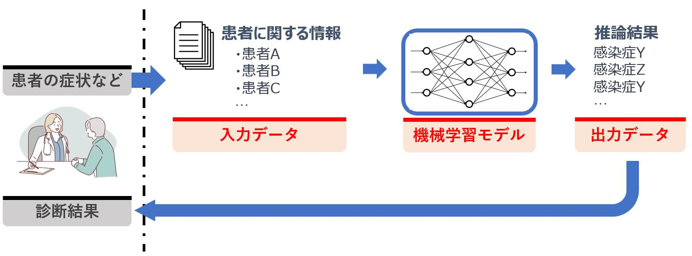
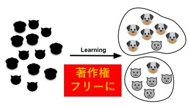
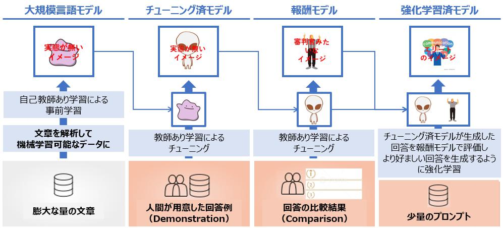

---
link:
  - rel: 'stylesheet'
    href: '_css/main.css'
lang: 'ja'
---

# 2章 機械学習入門{#h1_1 .chapter}

##  生成AIと機械学習モデルの関係{#h2_1 .section}
 

前章では、生成AIの背景にはTransformerという機械学習モデルがあると述べましたが、そもそもAIとは何か、機械学習モデルとは何か、という点に始まり、生成AIの基礎となるディープラーニングまで理解を深めていきます。図X-Xに、大まかな関係を図示しましたので、この図を参照しつつ本文を読み進めて下さい。

@div:figure
{height=250}

図X-X 人工知能と生成AIの関係

@divend

### AI（Artificial Intelligence）とは

昨今はAIという言葉が汎用的に使用されるようになり、非常に広範囲なサービスや仕組みにAIという言葉が冠されている場面も見受けられます。
2023年には、米国連邦取引委員会がAIを使ってオンラインストアの売り上げを増やすという根拠のない謳い文句で消費者に損害を与えたとして、このサービスを提供する会社が提訴される消費者に与えた損失額は2,200万ドルとのこと。訴状によると被告企業は「AIやchatgptのようなツールを使って、月1万ドル以上稼ぐ！」等と案内しており、日本でもありそうな広告だな、という印象でした。（事件番号3:23-cv-01444、"Federal Trade Commission v. Automators LLC"）など、行き過ぎたAI表示このように、AIを使用していないのに使用しているように見せかけることを"AI washing"と表現するメディアも現れました。（https://www.techopedia.com/ai-washing-everything-you-need-to-know/2/34841）環境配慮をしているように装う"greenwashing"や、白人以外の役柄に白人俳優を配役する"whitewashing"という表現は既に一部の英語辞書に登録されていますが、近い将来に"AI washing"も新語として広く認知されるかもしれません。
に対する規制色も強まっています。なお、同委員会は日本における公正取引委員会に相当し、同訴訟はAI関連の虚偽表示に関する同委員会初の個別案件となりました。

文献を見渡すとAIは様々に定義され、時には非常に広い意味を持つことがあります。AIという言葉の定義が立場により不明確例えば、日本の総務省は次のように説明しています。「AIに関する確立した定義はない（中略）あえていえば、『AI』とは、人間の思考プロセスと同じような形で動作するプログラム、あるいは人間が知的と感じる情報処理・技術（略）」（令和元年版情報通信白書）である以上、AI関する概念を理解する事は（先ほどのような詐欺まがいの案件に引っかからないためにも、）機械学習やディープラーニングを理解する上でも重要となりますので、少し範囲を広げて説明します。

そもそもAIは、1965年のダートマス会議で用いられるようになった言葉です。この会議ではAIの研究の方向性や目標が議論され、AIの研究が本格的に始まるきっかけとなりました当時ダートマス大学で数学助教授だったJohn McCarthy氏が主催した世界初のAIに関する国際会議で、第1次AIブームのきっかけとなります。自然言語処理や、ニューラルネットワークに関する研究を含む7つの議題を提起し、今日も研究が継続されています。（https://doi.org/10.1609/aimag.v27i4.1904）
。
ここで、AIという単語の意味合いを考慮すると、人工的（artificial）な知能（intelligence）ですから、*人間が備えているような知能を人工的に再現するもの*、と説明できそうです。
昨今の生成AIの発展を鑑みると、何をもって知能と定義するかについては意見が分かれるところですが、凡そ次のように記述する事が出来そうです。

- 幅広い環境において目標を達成する（学習能力、適応能力を含む）能力人工知能研究者であるM. Hutter氏が、2007年に公開した論文"A Collection of Definitions of Intelligence"（意訳：「知能」の定義集）では、辞書、哲学者、AI研究者らによる合計70余りの「知能」に対する定義がまとめられています。本論文では、最終的に“Intelligence measures an agent’s ability to achieve goals in a wide range of environments...Features such as the ability to learn and adapt, or to understand...”という表現を採用しており、本書ではこの意訳を紹介しました。少し古い論文ではありますが、多くの論文（2020年以降に公開された論文を含む）に引用されています。（https://arxiv.org/abs/0706.3639v1）

この定義を考慮すると、昨今の生成AIは一部の領域では既に人間の回答能力を上回っていることから、既に知能を獲得したように思えますが、「幅広い環境において」という表現がポイントです。現在のAIは種々のモダリティを扱う事が可能で、幅広い環境（分野）の中における特定のタスクにおいて優秀な能力を発揮しますが、幅広い環境を跨いで人間と同様な認識能力や知的作業を実行できるわけではありません。このように環境を問わず汎用的な能力を獲得したAIはAGIAGIはArtificial General Intelligenceの略で、strong AI、Full AIとも称されます。と表現され、現在盛んに研究が行われています。AIのレベル感は次の３つに大別されます。

#### AGI（Artificial General Intelligence）
直訳すると*汎用人工知能*となり、strong AI（強いAI）、Full AI、等とも表記されます。このレベルに達すると人間と同等な知能作業が可能になるため、文脈によってはHuman Level AIとも表現されます。
今はAGIの実現に向けて手法を探っている段階であり、現状は実現されていないと考えられています。この人間と同等な能力を獲得したAGIに対して、生成AIに代表されるような特定の能力（例えばChatGPTならば人間と対話する能力）に特化したAIを、ANIと呼びます。

#### ANI（Artificial Narrow Intelligence）
直訳すると*特化型人工知能*となり、weak AI（弱いAI）、Narrow AI、専門AI、等とも表記されます。現在ビジネスの場面でも用いられている、音声認識、画像認識、文章生成など、特定のタスクをこなすAIを指します。*世間一般的にAIといえばANIを指す*と考えてよいでしょう。

#### ASI（Artificial Super Intelligence）
直訳すると*人工超知能*となり、AGIから更に発展したAI、すなわち人間の能力を凌駕する能力を獲得したAIを指します。イメージとしては、近未来を描いたSF映画等に出てくるAIだと思ってよいでしょう。現状は存在しませんが、OpenAI社は2023年7月に、来るべきASIに備えて専用のチームOpenAI社が公開したBlogによれば、ASIは「人類が発明した中で最もインパクトがあり世界的に重要な多くの問題を解決する助けとなるだろうが、この能力は非常に危険で人類を無力化、あるいは絶滅させる可能性さえある。」と記述しています。（https://openai.com/blog/introducing-superalignment）を発足し、SAIが人類の期待とは別方向に進化しないように制御する（アラインメント問題に対応する）ために、今後4年間で20％の計算リソースを投入して取り組む旨を発表しています。2024年にはMeta社も同様にAGIの構築とオープンソース化を目指して開発をする旨を発表しています出典：https://www.theverge.com/2024/1/18/24042354/mark-zuckerberg-meta-agi-reorg-interview。

@div:figure
{height=200}

図X-X 一般的なAI（ANI）ーAGIーASIの位置づけ

@divend

ここまで述べただけでもAIという言葉が、実際にはAIではないものを指したり、まだ存在しないものを指したり、様々な意味合いを含んでいることがイメージできたかと思います。
ここで先述した知能の定義にあった学習、適応とは何かという点を考えたいと思います。

#### 学習、適応とは？
機械*学習*とは言いますが、AIにおける学習とは何なのか、具体例と共に理解を深めていきたいと思います。

具体例として、来院してくる患者が何の感染症に罹患しているかを診断する場面を考えてみましょう。感染症を特定するには、様々な診断や検査が必要です。そこで、事前に専門医の知見を集めて臨床基準を作成することにしました。例えば「患者に発熱はあるか？」「細菌を含む痰を咳き出しているか？」「患者には重大な感染を示唆する皮膚や血液の所見があるか？」「胸部X線は正常か？」「痛みや炎症があるか？」などです。更に「発熱があった場合は感染症Xが疑われる」「咳や痰に細菌が含まれる場合には、●●かどうかを確認する」といった規則（ルール）を棚卸してフローチャートのような形にまとめました。実際に診断を行う際には、このフローチャートに従って診断を行えば答えていけば、診断結果を得ることができるでしょう。このように作られたシステムとして"MYCIN"があり、実際に1970年代にスタンフォード大学で開発されました本書におけるMYCINの解説は、次の2文献に基づいています。"Rule-based Expert Systems : The MYCIN Experiments of the Stanford Heuristic Programming Project" (Edward H. Shortliffe,et al., 1984)、"Computer-Based Medical Consultations, MYCIN" (E.H. Shortliffe, 1976)。このシステムは人間の医師ら専門家（エキスパート）の知識を体系化して演繹的にルール化したもので、（ルールベース）エキスパートシステムこのMYCINは学術界では大きく取り上げられ、1977年のIJCAI（人工知能国際会議）では、このように知識体系をコンピューター内部で表現して利用する研究分野を知識工学（Knowledge Engineering）と命名し、AIの一分野を形成することになりました。と呼ばれます。実際のMYCINに登録されているルールは次のようなものです。

@div:figure
{height=150}

図X-X MYCINのルール例

@divend

このシステムは全てのルールを人間が定義したもので、学習によってルールを獲得した訳ではありません。知識を体系化する専門家このような専門家は"Knowledge Engineer"と呼ばれていました。が感染症の専門医にインタビューして、ルールを定義する必要がありました。先の定義を鑑みると、学習をしないエキスパートシステムをAIに分類する事は難しそうです図X-Xに記したようにMYCINの基本ルールはIF~THEN構文で記述されます（IF文は計算表ソフトのExcel等で使用したことがあるかもしれません）。NYCINの推論機構は複雑ですが、このような人間が決めたルールベースのシステムをAIと見做してしまうと、極端な話ですがExcelで記述したIF文もAIになってしまい、線引きが困難になってしまいます。が、歴史的経緯を鑑みるとAIの文脈で語られ、AIに分類する文献も多いため、本書では広義のAI（ルールベースAI）として紹介しますこのようなルールベースのエキスパートシステムをAIではないと明示的に主張する文献もあります（例：https://doi.org/10.1016/j.bushor.2018.08.004）。
<!-- 更に、仮に新たな細菌感染症が発見されてこのシステムを更新するとなった場合、新しい診断基準を医師らで決定し、500ある既存の規則との組み合わせを考えて実装するというパズルのような作業が必要になるでしょう。この意味で適応能力があるとも言えなさそうです。 -->

では、過去の診断結果を使ってルールの中身、つまり感染症を*推論する構造を自動的に作成する*ことができたらどうでしょう。例えば、過去の診断データを分析し「XX感染症に罹患した人の特徴として、体温は35.6℃以上で年齢は30歳以上で…」という示唆が得られたとして「35.6℃以上で年齢が30歳以上ならばXX感染症と診断する」ルールを設けるといった具合です。このように、データから帰納的にルールを計算してルールを組合わせる処理が機械学習です。このように人間がルールを教え込むことなく自律的に獲得する所作を学習と表現します。

@div:figure
{height=220}

図X-X 演繹的なアプローチと、帰納的なアプローチ

@divend

機械学習を用いる場合、学習データを与えさえすればルールを自動的に獲得するため、ルールや組み合わせを教えることが手間な場合や、人間でさえも明示的なルールが分からない場合であっても、データから自動でルールを見つけ出す事ができます。このように適応力に長けた機械学習は昨今のAIの基本技術となっています。

@div:figure
{height=120}

図X-X ルールベースと機械学習

@divend

#### 参考："MYCIN"との「対話」例
ルールベースで動く"MYCIN"は、人間の知識を体系化したデータベースシステムが意思決定を行うために使用するルール、事実、ドメイン固有の知識を格納し、"Knowledge Base"とも称され、このような仕組みを持つシステムを"Knowledge Base"とも表現します。大局的には、ルールベースシステムの一部です。を持っており、そのデータベースに入出力を行うインターフェースを通じて人間と"対話"を重ねて疾患候補を特定します。図X-Xの例では、50回以上の人間との対話を繰り返して「細菌血症」という疾患名を出力していますこのMYCINが開発された同時期の出来事としては、初代ウォークマン発表('79)、世界初の自動車電話サービス登場（'79）が挙げられます。このシステムが動いていたというのは驚きですね。。

@div:figure
{height=350}

図X-X MYCINとの"対話"例
<!-- Rule-based Expert Systems : The MYCIN Experiments of the Stanford Heuristic Programming Project / edited by Bruce G. Buchanan, Edward H. Shortliffe (Addison-Wesley, 1984) -->

@divend

この対話部分だけ切り取ると、人間のスペルミスにも対応するMYCINには類義語辞書が登録されており、多少の表記ゆれや簡単な入力ミスやスペルミスは自動的に修正する事が出来たそうです。など昨今のChatGPTと遜色が無いような処理を行っているかのように見えます。実のところ、内部では（スペルミスをも想定した）人間が作成した膨大なルールに基づいて所定の回答を提示しており、学習を重ねて対話能力を獲得したChatGPTとは異なっているのです。一方で、上記の結果だけをみると内部は分かりませんので、このようなシステムをAIと呼ぶかどうかについては、場面や立場により意見が分かれるところでしょう。

#### まとめ
一般的にAIと言われた場合は先述したANIを指し、学習能力を実現する手法として機械学習が主として用いられている、という事を押さえておきましょう。結局のところ実務的には「AI＝ANI＝機械学習」というざっくりな見方もできそうです。一方で将来的な展望を語る局面ではAGIなども含むと考えられるため、場面に応じた解釈が必要になる、という点も意識しましょう。

次節では、昨今のAIにおいて欠かすことができない機械学習について理解を深めていきます。

<!-- 

<h4>MYCINとの"対話"例（載せる？）</h4>

MYCINは、人間の知識を体系化したデータベース（Knowledge Baseと呼ばれている）を持っており、そのデータベースに入出力を行うインターフェースを通じて人間と"対話"を重ねて疾患候補を特定します。（次の図では、50回以上の対話を繰り返して「細菌血症」という疾患名が出力されています。（初代ウォークマンが発表された時期('79)に、このシステムが動いていたというのは驚きですね）

{height=350}

この対話部分だけ切り取ると人間のスペルミスにも対応するなど昨今のChatGPTと遜色が無いような処理を行っているかのように見えます。内部では（スペルミスをも想定した）人間が作成した膨大なルールに基づいて動いており、学習を重ねて対話能力を獲得したChatGPTとは異なっているのです。一方で、上記の結果だけをみると内部は分かりませんので、このようなシステムをAIと呼ぶかどうかについては、立場により意見が分かれるところでしょう。

 
-->

<h4>結局AIとは何でしょう</h4>

本文中ではあえて明示的な定義を記述しませんでしたが、本文中で引用した知能の定義も斟酌すると『「幅広い環境において目標を達成する（学習能力、適応能力を含む）能力」をコンピューター上で再現するもの』、となります。この「幅広い環境」という表現の曖昧さにより、AGIとの境界が不明瞭となっている側面があります。また、先述した"MYCIN"や、1997年に当時のチェス世界王者を倒した"Deep Blue"米国IBM社が開発したチェス専用のスーパーコンピュータは両者ともに各領域で人間を上回る成果を出していますが、学習により能力を獲得していない点が本定義とは異なります。

アカデミックな世界から少し離れて、OECD"Recommendation of the Council on Artificial Intelligence (May 21, 2019)"より意訳。および米国法"H.R.6216 - National Artificial Intelligence Initiative Act of 2020", SEC. 3 (3)より意訳。当時のOECD勧告よりも詳細な定義が盛り込まれています。による定義を見てみましょう。

<strong><i>
人間が定義した特定の目的に対して、現実または仮想環境に影響を与える予測、推奨、決定を行うことができる機械ベースのシステム。さまざまなレベルの自律性で動作するように設計されている。
</i></strong>

上記の定義は広く書かれており、自律性の度合い（すなわち学習と適応能力のレベル）は問うていません。「知能」というからには学習能力が入っているべきだ、という視点に立てばエキスパートシステムはAIから除外されるでしょうし、OECDのように定義すれば含まれる、といった具合でしょう。立法者の立場からすれば、学習の有無を問わず、示唆を生み出す機械がAIである、としておけば丸っとAIを定義できるので簡便なのかもしれません。

技術の発展に伴って新たな定義表現の出現が予想されます。実のところ、最近の技術進展に伴って上記のOECDによる定義も3年も経たず2023年11月に更改されているのです更改の背景には、昨今の生成AIに使用されている「自己教師あり学習」があります。この学習手法は次節にて説明するので、更改の詳細は次節のMEMOにて紹介します。。常に変化し得るという点にもご留意頂ければと思います。

AIに関連する話題に触れる際には「相手が指しているAIは何だろう？」という観点も意識してみてください。本節を読んでAIに対する幅広さを感じ、興味を持っていただければ幸いです。

<!-- 

- 「機械学習」は、明示的にプログラムされることなく、データまたは経験に基づいて自動的に学習し、改善する能力をシステムに提供することを特徴とする人工知能の応用

 -->

##  機械学習とは{#h2_2 .section}
 

人間の学習に相当する仕組みをコンピューターで再現する機械学習ですが、具体的には次の通り明文化できます。

- 明示的にプログラムされることなく、データまたは経験に基づいて自動的に学習し、改善する能力をシステムに提供することを特徴とする人工知能の応用米国法"H.R.6216 - National Artificial Intelligence Initiative Act of 2020", SEC. 3 (9)より意訳。

機械学習モデルを作成する*学習フェーズ*と、学習した機械学習モデルを使って示唆出しを行う*推論/利用フェーズ*の2つに分けて、詳しく見てみましょう。学習とは、従来的な（非AI）ソフトウェア開発においてコードを記述してプログラムを作成する作業に相当します。

ここでは、具体例として「患者の属性や症状から感染症種別を判別する」タスクタスクは目的（object）とも称されます。この例の場合は感染症識別という明示的な目的を人間が機械に与えています。昨今の生成AIに用いられている「自己教師あり学習」では、明示的な目的が与えられない事もあります（後述）。を考えます。

@div:figure
{height=200}

図X-X 機械学習の2つのフェーズ

@divend

### 学習フェーズ（training phase, build phase）
ここでは、大量のデータを機械学習アルゴリズムに供給し、機械学習モデルがタスクを精度良く実行できるようにパラメーターを最適化させます。最適化されたモデルを推論モデル（学習済みモデル）と呼びますが、この*推論モデルを最適化する処理が機械学習*です。このフェーズにおいて重要な用語を押さえましょう。

#### 学習データ（training data）
モデルを最適化する上で必要なデータであり、図中では過去の大量の診断結果を指します。数字、文章、画像、など様々なモダリティのデータが考えられます。

#### 目的変数（objective/target variable）と特徴量（feature）
目的変数はターゲットとも呼ばれモデルの予測対象となる値であり、今回は感染症種別を指します。特徴量は目的変数を予測するために重要と思われる感染症種別を決める要素が100％分かっていれば（例えば体温と咳の有無だけで感染症を特定できるのであれば）、それらの要素のみを特徴量としてモデルに与えれば事足りるのですが、現実的には様々な要素が複合的に影響すると思われます。ドメイン知識を活用して目的変数に影響を与える要素を特定して特徴量を選択することが必要になります。この作業は実務において手間と労力を要する（とても泥臭い）工程となります。データであり、ここでは患者の属性や症状を指します。第1章で触れたように、機械学習モデルは数字しか理解できないので、「男性」「激しい咳」といった学習データに記述されている表現を数字表現に変換したものが用いられます。アルゴリズムはこれらを元にして、パラメーターを計算します。

#### 機械学習モデル（model）
特徴量と目的変数を関連付ける仕組みで、*入力された特徴量から予測値を出力する変換器*と捉えることができます。ここでは、患者の特徴量から感染症種別という結果に変換している変換器です。最初（学習を開始する前）この変換器は仮組状態（モデルの雛形がある状態）ですが、上手く学習が進めば与えられた特徴量に相当する感染症種別を精度よく予測する優秀な変換器へと変化します。学習が完了したモデルの事を推論モデル（学習済みモデル）と表現します。

#### パラメーター（parameter）
モデルを定義づける指標です。例えば図X-X中では「35.6℃」「激しい咳」といったモデルの分岐条件を決定付けているイメージです。使用するモデルによってパラメーターは異なりますので、次節以降で具体的に見ていきましょう。

#### アルゴリズム（argolism）
モデルがより高精度になるように、パラメーターを変更（更新）する仕組みです。最初のモデルを雛形に例えるなら、アルゴリズムは雛形をどのように造形すれば精度を改善することができるかを示す手順書に相当しますこの手順書に従って雛形からモデルを作る造形師がコンピューターといったところでしょう。モデルが複雑になるとモデルのパラメーター数も増大しますので、優秀な造形師、すなわち大規模な計算資源が必要になります。。
このアルゴリズムとモデルは時として同一に語られることがありますので、図X-Xでアルゴリズムの働きについて詳しく見ていきましょう。

@div:figure
{height=330}

図X-X 学習フェーズの中身

@divend

アルゴリズムが機能する前、すなわち学習する前のモデルで出力される推論結果は正解（真の結果）とは程遠く、ズレが生じています。このズレを損失（Loss）と呼び、損失を計算する式（関数）を損失関数（Loss function）と呼びます。
この損失を小さくするために、アルゴリズムはどのようにパラメーターを変更すればよいかを計算計算手法としては、例えば勾配降下法が広く用いられており、次節以降で扱います。し、機械学習モデルに反映します。学習フェーズでは、この一連の処理を繰り返して、損失が小さくなるようにモデルを更新し続けるこれ以上損失が小さくならなくなる時点まで計算を行いますが、過学習を防ぐために適当な時点で打ち切るような工夫もなされます。作業を行います。

### 推論/利用フェーズ（inference phase, use phase）
ここでは、学習フェーズで構築した推論モデルにデータを入力して出力を得ます。一般的に機械学習（すなわちAI）を利用する場面では、利用者側はこのフェーズしか使っておらず、AIの運用フェーズとも言えます。

#### 入力データ（input data）と出力データ（output data）
予測したい患者の属性や症状を指します。診断者が観測した患者の症状をモデルに入力します。
<!-- 
この際、モデル学習時に用いた特徴量と同じ表現でモデルに入力する必要があるため、何らかの変換処理が必要になる場合があります。
-->
出力側も同様に、モデルから出力された表現では人間が解釈できないので、学習時に用いた変換法と同様な手段を用いて変換結果を出力し、診断者に回答されます。

@div:figure
{height=150}

図X-X 推論/利用フェーズの中身

@divend

### 機械学習の種類
機械学習は、学習方法によって次の通りに大別されます特に「教師あり学習」「教師なし学習」「強化学習」の3つに大別して紹介されることがあります。。（先ほどの感染症種別を識別する例では教師あり学習を意識していますが、コンセプトは学習方法によらず同様です）

@div:figure
{height=250}

図X-X 機械学習の種類と代表的なモデル

@divend

#### 教師あり学習（supervised learning）
学習データに正解データが含まれている場合の学習手法です。例えば、図X-Xのように犬猫の「鼻の大きさ」「耳の尖り具合」という特徴に対して、それぞれ「犬」「猫」という正解（ラベル）を用意して学習します。
また、画像に写っている物体を識別するには、「この画像にが犬が映っている」といった、各画像に対する正解が割り振られているデータを学習データとして正解を予測する方法を学習します。
犬や猫といった、データを特定のカテゴリに分類する分類問題や、連続数字を予測する回帰問題次節で線形回帰問題を具体例として理解を深めましょう。に対して適用されます。本書では、線形回帰とロジスティック回帰を取り上げて具体的に説明します。

@div:figure
{height=100}

図X-X 教師あり学習のイメージ

@divend

#### 半教師あり学習（semi-supervised learning）
昨今のAIを学習するには大量のデータが必要で、全てのラベルを用意する事は困難です。そこで、一部のデータのみにラベルを付与して学習する手法教師あり学習と教師なし学習の中間に位置する学習手法です。少量のラベル付きデータを用いてモデルを生成し、このモデルを使ってラベルなしデータに対して推論を行って、高い確信度を持つを新たなラベル付きデータとして学習に使用する"self-training"、どのラベル無しデータに優先的にラベル付与すべきかを能動的に決定する"active learning"など、種々の学習方法が提案されています。（https://doi.org/10.1007/s10994-019-05855-6）で、主に分類問題で用いられます。例えば、図X-Xのように「鼻の大きさ」「耳の尖り具合」といった定量的な測定値（特徴量）と、「犬」「猫」のラベルから、犬と猫とを識別する曲線を描くイメージです。

@div:figure
{height=150}

図X-X （半）教師あり学習のイメージ

@divend

#### 教師なし学習（unsupervised learning）
ラベルが無いデータを学習し、データの構造やパターンを見つけ出す手法手法です。人間では気付きにくい（もしくはデータが多量で見切れない）データ内の隠れたパターンや構造を発見し、新しい知見を得るために用いられます。類似のデータをグループ化するクラスタリング（図X-X）といった手法が有名であり、顧客セグメンテーション等に用いられます。

@div:figure
{height=150}

図X-X 教師なし学習「クラスタリング」のイメージ

@divend

#### 自己教師あり学習（SSL; self-supervised learning）自己教師あり学習も、半自己教師あり学習も、頭文字は同じSSLですが、一般的にSSLと表記された場合には自己教師あり学習を指します。predictive learning（予測学習）、pretext learning（疑似学習）とも表記されます。教師あり学習に分類する文献（https://doi.org/10.1093/bib/bbab016, 2021）や、教師なし学習に分類する文献（https://doi.org/10.1007/s11831-023-09884-2, 2022）もあります。本書では独立した学習手法として取り上げました。
ラベルを含まない学習データから、ラベルを自動生成して疑似的なタスク（pretext task）を学習します。例えば大規模言語モデルの学習では、図X-Xに示すように与えられた文章の一部を穴埋めし、穴埋めされた箇所の単語や文章を予測ここでは、穴埋めした単語を中心として、その周囲から予測するというCBOWアプローチを図示しています。詳細は第3章で扱います。する事によって、文章の構造や表現手法を獲得します。

@div:figure
{height=120}

図X-X 自己教師あり学習のイメージ

@divend

人間が個別の穴埋めタスクを定義している訳ではなく、与えられた文章から自ら穴埋め問題を生成して学習しているのです機械学習において、従来は人間がAIにタスク（目的）を与える必要があるとされていましたが、このような学習法が新たに提案されたことによりAIの定義も変化しました（後述）。。この自己教師学習で学習されたモデルに対し、人間が期待する回答を出力する下流タスクをファインチューニング既に学習済みのモデルを特定のタスクやデータセットに合わせて微調整するプロセスを指します。特に、大規模なデータセットで事前学習されたモデルを、比較的小規模なデータセットでの特定のタスクに適用する際に用いられます。させることによりChatGPT等の高性能なチャットボットが作られています。このように、SSLは主に深層学習モデルの事前学習に用いられています。

#### 強化学習（RL; Reinforcement learning）
試行錯誤を通じて最適な行動（定義された報酬を最大化するような行動）を自律的に学習する方法です。ゲームプレイ人間がコンピューターゲームのハイスコアを目指して攻略法を研究する様子に似ています。Google DeepMindによって開発された囲碁AI"AlphaGo"は強化学習を活用して2015年に人間のプロ囲碁棋士を破りました。囲碁は「膨大な探索空間と碁盤の位置を評価する事が難しく、AIにとって古典的なゲームの中で最も困難なゲーム」と見做されていたため、注目を集めました（http://dx.doi.org/10.1038/nature16961）。、自動運転車、ロボット制御などに応用されています。例えばゲームの場合は勝敗やスコアといった報酬を定量化して与え、自動運転の場合は「車線の内側を走行したら加点」「人や物体に衝突したら減点」といった具合で報酬を計算して与えます。

### 種々の機械学習手法を組み合わせてできたChatGPT
今まで種々の機械学習手法について説明してきましたが、ChatGPTは複数の機械学習手法を組み合わせて実現されており、図X-Xを用いて次のように説明できますChatGPTの前身であるInstruct-GPTの論文（https://doi.org/10.48550/arXiv.2203.02155）を参考にしました。論文という形式では公開されていませんが、ChatGPTの学習法についてはOpenAIがブログ記事（https://openai.com/blog/chatgpt）を公開しており、同等な仕組みとなっています。。

- 大量の文章に自己教師あり学習を行い文章構造に対する知識を獲得させます。このように作ったモデルを*大規模言語モデル*と呼びます
- この大規模言語モデルに対して、人間がプロンプトに対する好ましい回答例（Demonstration）を作成し、これを正解として教師あり学習を行いチューニング既にある大規模言語モデルに対してチューニングを行うので、Supervised fine-tuning（SFT）と称されます。します。
- このチューニング済モデルを使ってい、あるプロンプトに対する回答案を幾つか作成させます。この作成された回答案を人間が順位付けし、この比較結果（Comparison）を学習して報酬モデルを作成します。この報酬モデルは、人間の比較結果を再現できるようになります人間の採点結果を模倣する採点官を作り上げるようなイメージです。。
- チューニング済モデルに対して新しいプロンプトを入力して回答を生成させ、この回答を報酬モデルで評価し、より好ましい回答を生成するように強化学習を行います。

人間からのフィードバックを元に、教師あり学習と強化学習を行うコンセプトは理解し易い部分ではかったのではないでしょうか。このように人間のフィードバックを学習プロセスに組み込む手法は、*RLHF（Reinforcement Learning from Human Feedback）*と呼ばれています。

本章では扱いませんでいたが、ChatGPT、ひいては生成AIの起点となる大規模言語モデルがどのようにして作成され、なぜ知識を獲得したのかという点については第3章以降で扱います。

@div:figure
{height=260}

図X-X ChatGPTの学習法

@divend

本章はAIと機械学習について理解を深めて頂くことが目的ですので、これから代表的な次の3つのモデルを通じて、機械学習の基本を押さえていきましょう。
- 線形回帰 ～”数字”を予測する～
  - 数字（連続値）を予測する回帰モデルの中でも基本的な線形回帰を説明し、モデルとは何か？パラメーターとは何か？などについて具体的なイメージを深めていきましょう
- ロジスティック回帰 ～”ラベル（Yes/No）”を予測する～
  - ニューラルネットワークの基本となる単純パーセプトロンとは何か？について学びましょう
- ニューラルネットワーク ～より複雑な問題を予測する～
  - 昨今の生成AIを構成する深層学習の構造について理解を深めましょう

<h4>AIに対する別の見方</h4>

本文中で紹介した自己教師あり学習は生成AIの基礎となる大規模言語モデルの学習に適用され、昨今の生成AIにおいて重要な技術となっています。ここで、前節で紹介した、AIの定義に関する2020年のOECD勧告を振り返ってみましょう。同定義の中に「人間が定義した特定の目的に対して」という文言があります。本文で紹介した自己教師あり学習は疑似的なタスク（pretext task）を学習します。「疑似的な」と訳しましたが、ニュアンス的には「でっち上げ」"pretext"という単語は、前を意味する接頭辞"pre-"と織物を表す"texture"から成ります。生地の前面を表すため、取り繕っている様や隠匿を意味する、どちらかというと悪い文脈で用いられる言葉です。となります。すなわち、人間では明確なタスクを与えているわけではなく自律的に文章を学習しているため、何をどのように学んでいるかについては未解明な部分も多いのです第1章MEMO「学習する事によって知識を得た大規模言語モデル？」を参照。。
少なくとも、この定義のままでは大規模言語モデル、ひいては生成AIを包含する事が困難であるため、2023年にOECDは勧告を次の通り更改しました。具体的には「人間が定義した特定の目的に対して」という記述が削除され、代わりに「明示的または暗黙的な目的に対して」（explicit or implicit objectives）という表現を用いています。

<strong><i>
明示的または暗黙的な目的に対して、受け取った入力から、予測、コンテンツ、推奨、または物理的または仮想的な環境に影響を与えることができる決定などの出力を生成する方法を推論する機械ベースのシステム。システムによって、自律性や導入後の適応性のレベルは異なる。
</i></strong>

本節の図X-X「機械学習の2つのフェーズ」と同様な事柄を、OECDは次図AIの定義を更新したことをアナウンスするニュースレターに掲載された図表を筆者が編集しました（https://oecd.ai/en/wonk/ai-system-definition-update）のように表現しています。アルゴリズムなどの表現は使用せず「AI Model」という広い概念で、本節で述べた各種役割を包含しています。コンセプトとしては、外部環境から画像や文章といった情報を認知（perceive）した後に、AI Modelが受け取れる形式に加工してAI Modelに送り、Modelからの出力結果を望ましい形式に変換して外部環境に何らかの影響を与える、といった大きな概念になっています。

##  線形回帰 ～”数字”を予測する～{#h2_3 .section}
 

本節では具体的な機械学習モデルとして線形回帰（linear regression）を学んでいきましょう。線形回帰モデルは直線で描かれる一次式によって推論を行う基本的なモデルです。
まずは具体例として「*とある球場のビール巡回販売の売上を予測する*」タスクを考えましょう。

### 球場のビール売上を来場者数から予測する（単回帰）
この球場では試合中に売り子によるビールの巡回販売が行われており、球場全体のビール売上の大半を占めており、重要な収入源となっています。事前に巡回販売によるビール売上を予測する事が出来れば、適切な人数の売り子と機材（ビールやビアサーバー等）を手配することができ、機会損失リソース（今回の場合は売り子の人数や機材）の不足によって販売機会を逃すことで、本来得られるはずの利益を失うこと。チャンスロスとも呼ばれます。や余剰な支出本来必要なリソースよりも多く準備してしまうことで、今回は売り子が時間を持て余してしまったりビールの在庫が余ってしまう場合を指します。単純にロスとも表現され、機会損失とトレードオフの関係にあります。を抑えることができそうです。ここで、従来はベテラン社員の「経験と勘」を使って売上を予測していた業務を、線形回帰モデルを活用して業務改善していきましょう。

@div:figure
{height=180}

図X-X 今回のケースにおけるモデルと実業務の関係

@divend

図X-Xに今回のケースにおけるモデルと実業務との関係を図示しました。線形回帰モデルは、過去のデータから試合当日の売上を予測することが求められています。ビールの売上を左右する要因としては、来場者数厳密には来場者数は試合が始まるまで分からないのですが、ここでは前売りチケット販売数などで正確に予測できるという仮定を置きましょう。気候などについても天気予報等で予測できるという同様な仮定を置いていると考えてください。、気温や天候、客の年齢層、試合の盛上り度合、キャンペーンの有無球場によっては、ビール半額デーや、震災復興チャリティとしてビール売上の一部を被災地に寄付するキャンペーンを行う事があり、概して売上が増加するそうです。、といった様々な要因が考えられるかと思います。まずは単純化のため、来場者数だけに絞って線形回帰モデルを構築していきましょう。
第2節で紹介したように、教師あり学習は基本的に「学習」と「推論」のフェーズに分かれていますので、それぞれのフェーズについて詳しく見ていきましょう。

#### 学習フェーズ
今回の線形回帰モデルの学習の流れは、図X-Xのように整理できます。

@div:figure
{height=320}

図X-X 線形回帰モデルの学習フェーズ（単回帰）

@divend

今回は過去のデータの中から来場者数のみを特徴量として使用します。目的変数はビールの売上[杯]です。ここで、線形回帰モデルについて理解を深めるために、これらの特徴量と目的変数を可視化してみましょう。

図X-Xでは、$x$軸（横軸）を来場者数、$y$軸（縦軸）をビール売上とし、青丸は過去の売上実績を表しています。このような青丸の羅列を眺めると、一本の直線が引けそうです。この直線は一次式で表すことができ、切片（$\alpha$）と傾き（$\beta$）という2つのパラメーターによって定義付けられます。前節において、モデルとは特徴量と目的変数を関連付ける仕組みと説明しましたが、ここでは来場者数（$x$）からビール売上の予測値（$\hat{y}$）を出力する一次式がモデルとなります一次式の数式として$\alpha$、$\beta$といったギリシア文字が出てきましたが、これらは慣例的によく用いられる記号です。特徴量としては$x$が記号として用いられ、予測値は$\hat{y}$（発音的には「ワイハット」「ワイキャレット」）と表現されます（英字$y$の上に載っている"^"はハット/キャレットと呼ばれ、予測値ないし推定値であることを表現する記号です）。この一次式で表される直線は回帰直線とも呼ばれ、この回帰直線を求める手法を回帰分析と呼びます。特に、今回のように特徴量が単一の場合は単回帰分析とも呼ばれます。

@div:figure
{height=150}

図X-X 特徴量と目的変数の関係

@divend

さて、図X-Xのように「それらしい（尤もらしい）」直線を描くには$\alpha$と$\beta$を調整していけばよいのです。すなわち、雛形である「$\hat{y} = \alpha ＋ \beta x$」に対して、アルゴリズムを用いて$\alpha$、$\beta$の組合せを計算してモデルを構築していきます。例えば図X-Xのように、$\alpha$の値を大きくすると直線は上方に移動し、$\beta$の値を大きくすると直線の傾きが大きくなり右肩上がりになる、といった具合です。

@div:figure
{height=150}

図X-X 一次式のパラメーターを調整するイメージ

@divend

調整の方法は分かったとして、何を以って「それらしい」かを数学的に定義する必要があります人間からすると、見た目で直線を良しなに配置する事もできそうですが、他の人に説明する事は意外と難しいのではないでしょうか。損失関数は、このもどかしさを数学的に説明する表現であるという見方もできそうですね。。この数学的表現を損失関数と呼び、線形回帰モデルの場合には、*残差平方和*残差平方和はRSS（residual sum of squares）、SSR（sum of squared residuals）、SSE（sum of squared estimate of errors）とも表記されることがありますが、いずれも同等と考えてよいでしょう。また、合計値ではなく平均値を取った平均二乗誤差（MSE; mean squared error）も損失関数の一つです。今回は、著名なpython向けの機械学習ライブラリである"scikit-learn"に基づきRSSを採用しています。（https://scikit-learn.org/stable/modules/linear_model.html）が多用されています。少々堅苦しい名称ではありますが、図X-Xを見ながらイメージをつかんでいきましょう。

@div:figure
{height=150}

図X-X 一次式のパラメーターを調整するイメージ

@divend

残差平方和という言葉を解釈すると、「残差を平方（二乗）して合計した値（和）」となります別の説明をすると、平方（squared）とはある数を二乗すること、和（sum）は合計値を意味しますので、残差（residual）を二乗した合計値のことです。。残差とは、青丸で表現されている*実測値と予測値（すなわち直線上にある点）との距離*のことです。単純に、全ての実測値において残差を計算して和を計算してもよい気もしますが、残差をそのまま使うとマイナス値をとることもあり、全体的な当てはまり具合を計ることが難しくなります。そこで、全ての残差をそれぞれ二乗した後に合計を計算する手法が採られています二乗することにより、残差が大きいほど過大に算出することができるので、大きな間違いを重視して評価でき、学習しやすくなります。。

ここからがアルゴリズムの出番です。アルゴリズムは、パラメーターを調整する仕組みでした。今回は勾配降下法という手法を例として取り上げます線形回帰分析の場合、最小二乗法を用いることもできます。。前述の通り、$\alpha$と$\beta$の組合せ決めれば損失関数である残差平方和を求めることが出来、これら3つの値の関係は3次元空間に描画する事が出来ます図X-Xのグラフを見る際には、$\alpha$と$\beta$を緯度と経度、残差平方和を標高と考えると立体的なイメージが浮かびやすいかもしれません。。

@div:figure
{height=200}

図X-X 勾配降下法でパラメーターを決めるイメージ

@divend

図X-Xの通り、$\alpha$と$\beta$の組合せによって、図における高さ方向の残差平方和が算出できるため、お椀の底面のような立体的な曲面がイメージできます。アルゴリズムの役割としては残差平方和を小さくする事でしたから、お椀の最低位置に相当する部分の$\alpha$と$\beta$の組合せを探すことになります。探し方としては、ある位置における曲面の傾きを求め、傾き具合に応じて次に進む方向と距離を計算しているのです。
最初から曲面の全容が分かればよいのですが、それを把握するためには無限の$\alpha$と$\beta$の組合せを用いた場合の残差平方和を算出する必要があり不可能今回の線形回帰モデルにおいては、このようなお椀形状になることが知られているため図を描けるのですが、実際の計算過程では曲面の全容は分かりません。ある位置の傾きしか知ることができないのです。よく目隠し状態で自分の足の感覚を頼りに山下りをしているイメージです（そのまま"a blind-folded hiker"と比喩して解説する文献も散見されます）。なので、このような手法を取っています。
アルゴリズムは「この位の傾きなら、この方向にこの位進めばいいよ」といったような指示を出し、これ以上良くならない地点に到達するまで誘導しているのです。
このように最適なパラメーター（$\alpha$と$\beta$）の組合せが得られると線形回帰モデルが完成し、学習フェーズは終了です。

#### 推論/利用フェーズ
学習フェーズで得られた線形回帰モデルに対して、試合当日のデータ（$x$）を入れれば、当日の予想ビール売上（$\hat{y}$）が得られます。

@div:figure
{height=280}

図X-X 線形回帰モデルの2つのフェーズ

@divend

このようにモデルを利用する事によって
- 学習には用いていないデータからでも予測値を算出過去データから無限のパターンを獲得する事は不可能です。今回の場合、例えば過去データの来場者数を昇順で並べて「... < 26,888人 < 29,743人 < 33,685人 < ...」となったとします。仮に当日の来場者数が29,000人であった場合も、過去データは参照するパターンが存在しませんが、モデルを用いて予測する事が可能です。でき、
- モデル表現を解釈することによって特徴量が予測値に与える影響を定量化今回の線形回帰モデルの場合、$\beta$は直線の傾きですので、試合当日の来場者が一人増える毎にビール売上がどれだけ変化するかを計算できます。例えば、$\beta$が0.25だとすると、一人当たり0.25杯、すなわち4人増えると1杯増える、といった具合です。できる、

といったメリットを享受できます。

### 球場のビール売上を複数の要因から予測する（重回帰）
先ほどは一つの特徴量である来場者数（$x$）からビール売上を予想しましたが、売上を左右する要因は複数ありそうです。例えば、暑いとビールの売上は伸びそうですので、気温を特徴量に追加し、来場者数（$x_1$）と気温（$x_2$）からビール売上を予測する線形回帰モデルを考えましょう。先ほどの単回帰分析と同様、一次式で表される回帰直線がモデルとなりますが、複数の特徴量を扱うので重回帰分析と呼ばれます。

@div:figure
{height=180}

図X-X 線形回帰モデルの学習フェーズ（重回帰）

@divend

図X-Xに学習フェーズの一部を描画しましたが、単回帰分析の図と大差ないことが分かると思います。単回帰分析も重回帰分析も基本的な考え方に違いはなく、単純に特徴量の数が増えているだけ、と捉えてください。
勾配降下法を用いてパラメーター（$\alpha$、$\beta_1$、$\beta_2$）の組合せを最適化するという点も同じです。単回帰の場合はパラメーターは２つでしたから、３次元空間に描画して紙面で説明する事が出来ましたが、今回の場合はパラメーターが３つになりますので描画するとしたら４次元空間が必要です。人間にはイメージしにくいですが、アルゴリズムは先ほどと同様なコンセプトで４次元空間上のお椀の底（残差平方和が最低となる$\alpha$、$\beta_1$、$\beta_2$の組合せ）を探してくれるのです。

### 参考：他の球場のビール売上を予測する（非線形回帰）
先ほどの例では、線形回帰モデルを使って上手くビール売上を予測する事が出来ました。このモデルの有用性に気づいた他球場からも、モデル構築のオファーが来たとしましょう。まず、先ほどと同様に、$x$軸（横軸）を来場者数、$y$軸（縦軸）をビール売上とし、この球場の過去の売上実績を青丸でプロットし、図X-Xを作成しました。

@div:figure
{height=180}

図X-X 別球場のビール売上を考える

@divend

先ほどの球場と異なり、直線ではなく曲線にした方が上手い具合に青丸を表すことが出来そうです。線形回帰モデルでは$x$（重回帰の場合は$x_1$、$x_2$...）に関する一次式でモデルが表現されていましたが、この次数を上げることによって曲線を作ることができます。図X-Xに例示した曲線は$x$の3次多項式図に示した式では、$x$の最高次数が3（つまり$x^3$）なので、「独立変数$x$に対する3次多項式」と表現されます。であり、このような多項式を用いる回帰分析を多項式回帰（polynomial regression）と呼びます。

多項式以外にも曲線を表す式は無数指数関数（exp）、対数関数（log）、ガウス関数、三角関数などが挙げられ、これらを組み合わせてより複雑な曲線を表現する事も可能です。に考えられますが、このように直線ではない非線形な関係を表現できるモデルが非線形回帰モデルです。

### 参考：そのほかの回帰モデル
本書で扱った線形回帰モデルや多項式モデル以外にも多くのモデルが存在します。目的変数と特徴量の関係が線形であっても非線形であっても、適切なモデルを選択すれば上手い具合にデータの関係性を表現できます。一般的に、モデルの表現力が上がるにつれてモデルの内部構造は複雑化し、最適化するパラメーターの数も増加してアルゴリズムを実行する際の計算負荷が増えます。一方で、モデルが異なるだけで図X-X「学習フェーズの中身」で説明したように機械学習の処理自体は大差ありません。

個別の説明は本書では扱いませんが、ご興味があれば次のモデルについて調べてみてください。

- Ridge 回帰、Lasso 回帰、Elastic Net（線形回帰モデルの派生系モデル）
- 決定木
- ランダムフォレスト（XGBoost、LightGBM などの派生系モデルも多数存在）
- SVM（Support Vector Machine）

##  ロジスティック回帰 ～”ラベル（Yes/No）”を予測する～

##  ニューラルネットワーク ～より複雑な問題を予測する～

<!-- 
実際に米国では「AI」を誇張する企業
Aiming for truth, fairness, and equity in your company’s use of AI
https://www.ftc.gov/business-guidance/blog/2021/04/aiming-truth-fairness-equity-your-companys-use-ai
Keep your AI claims in check
https://www.ftc.gov/business-guidance/blog/2023/02/keep-your-ai-claims-check
 -->
