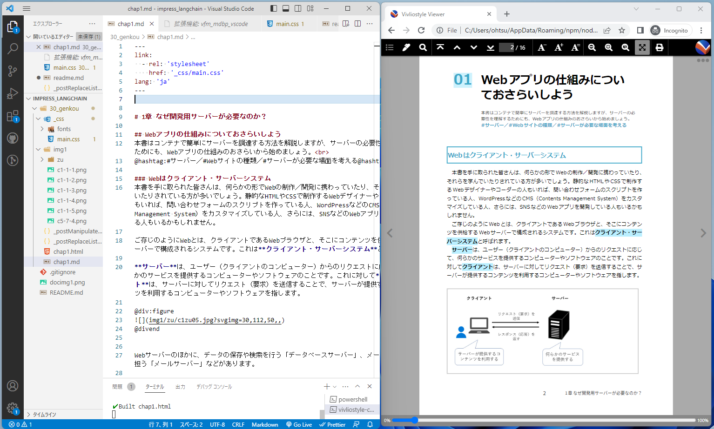
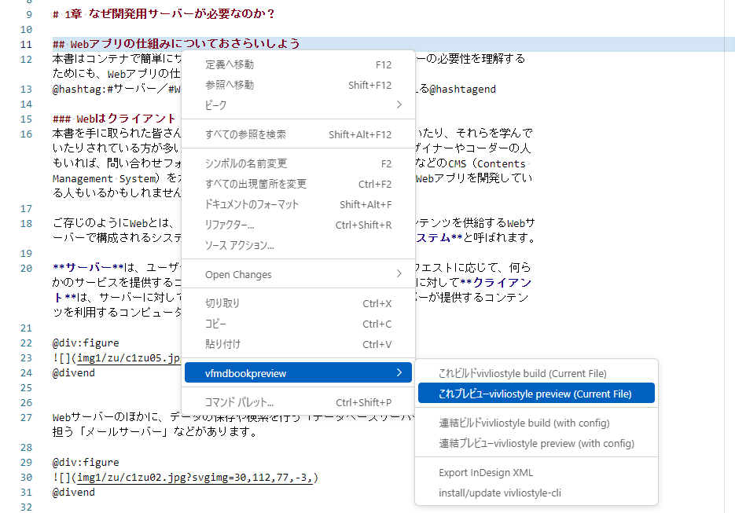
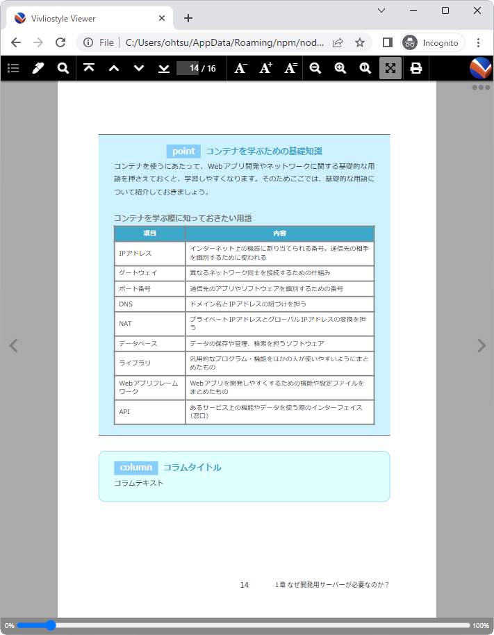

# インプレス社LangChain完全入門README

## ■■紙面プレビューの準備
VSCode用拡張機能を使うことで、紙面と分量感がほぼ同じプレビューを見ながら執筆・編集することができます。



Node.jsとVSCode用拡張機能、Vivliostyle.jsのインストールが必要です。インストール方法については下記ページから表示できる**書籍プレビューの26ページ以降**で説明しています。ただし、インストールする機能拡張は、vivliostyle-cli-helperではなく、**vfm_mdbp_vscode**にしてください。Vivliostyle.jsのインストールは、vfm_mdbp_vscodeの右クリックメニューから行えます。


https://libroworks.co.jp/?p=6956


操作方法は、書籍で説明しているvivliostyle-cli-helperとほとんど同じで、コードに行番号を付ける機能や画像をトリミングする機能が追加されています。


https://marketplace.visualstudio.com/items?itemName=Libroworks.vfmdbp-vscode


サンプルとして「Docker完全入門」の1章のMarkdownファイルを入れています（30_genkou/chap1.md）。インストール後に右クリックして［vfmbookpreview］→［これプレビューvivliostyle preview (Current File)］を選択すると、プレビューが表示されます。




## ■■Markdownのルール

ファイルの先頭にあるこれ（frontmatter）はCSSファイルを読み込む指示なので、カットしないでください。

```
---
link:
  - rel: 'stylesheet'
    href: '_css/main.css'
lang: 'ja'
---


# 1章 なぜ開発用サーバーが必要なのか？
```

### ■見出し
見出し類（h1～h6）は、以下の役割があります。

|見出し |Markdown表記 | 役割
|--|--|--
|h1 | # | 章タイトル（ファイルごとに1つ）
|h2 | ## | 節タイトル（直前で自動改ページされる）
|h3 | ### |小見出し（青罫囲み）
|h4 | #### | 小小見出しまたはコラムタイトル（青文字）
|h5 | ##### |未使用
|h6 | ###### | 図表やコードの見出し

h2見出しの直後の1段落は、リード文になります。また、@hashtag:～@hashtagendでリード文内にハッシュタグを書けます。

```
## Webアプリの仕組みについておさらいしよう
本書はコンテナで簡単にサーバーを調達する方法を解説しますが、サーバーの必要性を理解するためにも、Webアプリの仕組みのおさらいから始めましょう。<br>
@hashtag:#サーバー／#Webサイトの種類／#サーバーが必要な場面を考える@hashtagend
```

### ■ソースコード
コードの見出しに{.codenumber}を付けると、行番号入りのコード枠になります。また、コメント文の先頭文字を←（全角の右向きヤジルシ）にすると、引き出し線になります。

~~~
###### compose.yaml{.codenumber}
```yml
services:
  db:     #← PostgreSQLコンテナ
    image: postgres:14.2
    environment:
      POSTGRES_DB: testdb
      POSTGRES_USER: testuser
      POSTGRES_PASSWORD: testpass
    volumes:
      - db-data:/var/lib/postgresql/data
  web:      #← Djangoコンテナ
    build: .
    depends_on:
      - db
    ports:
      - "8000:8000"     #← ポート番号
    volumes:
      - .:/code   #← ボリューム
volumes:          #← ボリュームの作成
  db-data:
```
~~~~


### ■画像や操作手順
操作手順を入れたい場合は、画像（``）の前後を@div:figure～@divendで囲み、その中にリスト（箇条書き）を書きます（引き出し線はDTP段階で入れます）。

```
@div:figure

- ❸Webブラウザで「`http://localhost:8000/`」へアクセス
- ❹Djangoのトップページが表示される
@divend

```


画像ファイル名のあとに`?svgimg=`を書くと、画像の拡大率の調整やトリミングができます。

```


?svgimg=拡大率,幅,高さ,Xシフト量,Yシフト量
```

### ■コラムとポイント枠
コラムとポイントは見出し周りのみHTMLタグで書いてください。HTMLタグのあと、1行空けてください（タグのあとは1行空けないとMarkdownモードに切り替わりません）。

```
<div class="point">
<h4>コンテナを学ぶための基礎知識</h4>

コンテナを使うにあたって、Webアプリ開発やネットワークに関する基礎的な用語を押さえておくと、学習しやすくなります。そのためここでは、基礎的な用語について紹介しておきましょう。
……中略……

</div>
```

```
<div class="column">
<h4>コラムタイトル</h4>

コラムテキスト

<div>
```




### ■改ページ指定
水平線は改ページとして処理します。

```

---

```